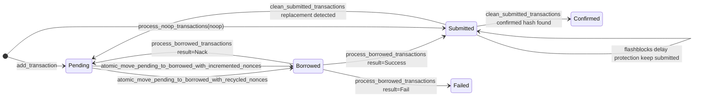

### Engine Core Nonce 管理(EOA executor)代码级生命周期

本说明基于 `engine-core-main` 的实际实现代码, 聚焦 EOA executor 的 Nonce 管理与交易生命周期. 目标是完整描述从请求入队到链上确认, 以及 crash recovery gas bump noop fallback nonce reset 等边缘路径.

### 1. 总体生命周期(从入队到完成)

```mermaid
flowchart TD
  %% ============= 入口: API 路由写入 store 并确保 worker job =============
  A0["收到 EOA 交易请求"] --> A1["构造 EoaTransactionRequest<br/>transaction_id = idempotency_key"]
  A1 --> A2["EoaExecutorStore.add_transaction<br/>HSET tx_data(user_request,status=pending,created_at)<br/>ZADD pending_txs(score=queued_at,member=transaction_id)"]
  A2 --> A3["TransactionRegistry.set_transaction_queue(transaction_id,eoa_executor)"]
  A3 --> A4["确保 EOA:chain idempotent job 存在<br/>job_id = eoa_{address}_{chain_id}"]
  A4 --> W0["EOA executor worker 运行一次 job"]

  %% ============= worker: lock 和主工作流 =============
  subgraph W["EOA executor worker: execute_main_workflow"]
    direction TB
    W0 --> W1["acquire_eoa_lock_aggressively<br/>SETNX lock_key worker_id<br/>冲突时直接 SET 覆盖(强占)"]
    W1 --> W2["Crash recovery: recover_borrowed_state"]
    W2 --> W3["Confirm flow: confirm_flow"]
    W3 --> W4["Send flow: send_flow"]
    W4 --> W5["统计 counts(pending,submitted,borrowed,recycled)"]
    W5 --> W6{是否仍有工作}
    W6 -->|是| W7["返回 WorkRemaining 并 requeue"]
    W6 -->|否| W8["job 成功结束"]
    W7 --> W9["release_eoa_lock(finally)"]
    W8 --> W9["release_eoa_lock(finally)"]
  end

  %% ============= Crash recovery =============
  subgraph CR["Crash recovery: borrowed -> (submitted or pending or failed)"]
    direction TB
    C0["peek borrowed_txs(hashmap)"] --> C1{borrowed 是否为空}
    C1 -->|是| CEND["结束"]
    C1 -->|否| C2["hydrate borrowed(user_request)"]
    C2 --> C3["按 nonce 排序"]
    C3 --> C4["并行 rebroadcast send_tx_envelope"]
    C4 --> C5["SubmissionResult.from_send_result(context=Rebroadcast)<br/>PossiblySent 视为 Success"]
    C5 --> C6["store.process_borrowed_transactions(batch)<br/>WATCH borrowed,recycled + lock"]
    C6 --> C7["每条 result: HDEL borrowed"]
    C7 --> C8{result 类型}
    C8 -->|Success| C9["ZADD submitted_txs(nonce,hash:id:queued_at:submitted_at)<br/>SET hash_to_id<br/>HSET tx_data status=submitted<br/>queue webhook send_attempt_success"]
    C8 -->|Nack| C10["ZADD pending_txs(now,transaction_id)<br/>HSET tx_data status=pending<br/>ZADD recycled_nonces(nonce,nonce)<br/>queue webhook send_attempt_nack"]
    C8 -->|Fail| C11["HSET tx_data status=failed,completed_at,failure_reason<br/>EXPIRE tx_data + attempts list<br/>ZADD recycled_nonces(nonce,nonce)<br/>queue webhook transaction_failed"]
  end

  W2 --> C0
  CEND --> W3

  %% ============= Confirm flow =============
  subgraph CF["Confirm flow: submitted -> (confirmed or replaced->pending) + nonce sync"]
    direction TB
    F0["RPC get_transaction_counts_with_flashblocks_support<br/>preconfirmed and latest"] --> F1{manual reset 是否已调度}
    F1 -->|是| F2["store.reset_nonces(current_chain_tx_count=latest)<br/>SET optimistic_nonce=latest<br/>SET cached_nonce=latest<br/>DEL recycled_nonces<br/>DEL manual_reset_key<br/>追加 health.nonce_resets 并更新时间戳"]
    F1 -->|否| F3["继续"]
    F2 --> F3

    F3 --> F4["读取 cached_nonce(last_tx_nonce)<br/>不存在则 NonceSyncRequired"]
    F4 --> F4A{NonceSyncRequired?}
    F4A -->|是| F4B["用 chain latest 初始化 cached_nonce<br/>store.update_cached_transaction_count(latest)"]
    F4A -->|否| F5["读取 submitted_count"]

    F4B --> F5

    F5 --> F6{preconfirmed <= cached_nonce ?<br/>是否无 nonce 进展}
    F6 -->|是| F7["检查 EOA health.last_nonce_movement_at"]
    F7 --> F8{nonce 停滞超过 1min 且 submitted_count>0 ?}
    F8 -->|否| F10["仍继续确认流程"]
    F8 -->|是| F9{EOA 是否 out_of_funds}
    F9 -->|是| F10["跳过 gas bump"]
    F9 -->|否| GB0["尝试 gas bump 或 noop fallback"]

    %% gas bump 分支
    subgraph GB["Gas bump: 针对 expected_nonce=preconfirmed"]
      direction TB
      GB0 --> GB1["store.get_submitted_transactions_for_nonce(expected_nonce)"]
      GB1 --> GB2{找到 newest(按 submitted_at 最大)}
      GB2 -->|否| GB3["发送 noop(expected_nonce) 并 process_noop_transactions"]
      GB2 -->|是| GB4["store.get_transaction_data(transaction_id)"]
      GB4 --> GB5{queued 时间是否超过 1min}
      GB5 -->|否| GB6["跳过 bump, 返回 false"]
      GB5 -->|是| GB7["build_typed_transaction(request,nonce)"]
      GB7 --> GB7A{build 或 simulation 失败?}
      GB7A -->|是| GB7B["必要时 update_balance_threshold<br/>再查询 fresh counts"]
      GB7B --> GB7C{fresh preconfirmed > expected_nonce ?}
      GB7C -->|是| GB7D["认为 nonce 已前进, 更新 health 时间戳<br/>返回 true, 让常规 confirm 接管"]
      GB7C -->|否| GB7E["返回 error"]
      GB7A -->|否| GB8["apply_gas_bump(120%) 并 sign"]
      GB8 --> GB9["store.add_gas_bump_attempt<br/>ZADD submitted_txs 追加新 hash 条目<br/>SET hash_to_id<br/>LPUSH attempts list"]
      GB9 --> GB10["send_tx_envelope(bumped)"]
    end

    GB10 --> F10
    GB3 --> F10

    F10 --> F11["如 latest != cached_nonce<br/>store.update_cached_transaction_count(latest)<br/>若 latest < cached_nonce 记录 reorg 或 RPC lag 风险"]
    F11 --> F12["waiting_txs = store.get_submitted_transactions_below_chain_transaction_count(preconfirmed)<br/>nonce < preconfirmed"]
    F12 --> F13{waiting_txs 是否为空}
    F13 -->|是| FEND["结束"]
    F13 -->|否| F14["并行 get_transaction_receipt(hash)"]
    F14 --> F15["confirmed: receipt 存在<br/>failed_or_replaced: receipt 不存在或 RPC error"]
    F15 --> F16["store.clean_submitted_transactions<br/>TransactionCounts(latest-1,preconfirmed-1)<br/>WATCH submitted_txs"]
    F16 --> F17["对 submitted 每个 hash 做清理与状态推进<br/>按 transaction_id 去重一次做业务决策"]
    F17 --> F18{transaction_id 是否 confirmed}
    F18 -->|是| F19["HSET tx_data status=confirmed,completed_at,receipt<br/>EXPIRE tx_data + attempts list<br/>queue webhook transaction_confirmed<br/>record metrics queued_to_mined"]
    F18 -->|否| F20{是否 NOOP}
    F20 -->|是| F21["仅清理 submitted 中的 NOOP hash 条目"]
    F20 -->|否| F22{nonce <= latest ?<br/>replacement 判定}
    F22 -->|是| F23["ZADD pending_txs(score=queued_at,member=transaction_id)<br/>queue webhook transaction_replaced"]
    F22 -->|否| F24["flashblocks 传播延迟保护<br/>保留 submitted 条目不动"]
    F19 --> F25["对该 transaction_id 的所有 hash 做 redis cleanup"]
    F21 --> F25
    F23 --> F25
    F24 --> F26["只对 nonce<=latest 的 hash 做 cleanup<br/>否则保留"]
    F25 --> F27["CleanupReport: 统计 moved_to_success,moved_to_pending,noop_count<br/>以及 cross_nonce_violations,per_nonce_violations,nonces_without_receipts"]
    F26 --> F27
  end

  W3 --> F0
  FEND --> W4

  %% ============= Send flow =============
  subgraph SF["Send flow: pending -> borrowed -> submitted, nonce 分配与预算控制"]
    direction TB
    S0["get_eoa_health<br/>不存在则初始化(balance from chain, threshold=0, timestamps=now)"] --> S1{balance <= balance_threshold ?}
    S1 -->|是| S2{balance 是否过期超过 5min ?}
    S2 -->|是| S3["链上刷新 balance 并 update_health_data"]
    S2 -->|否| S4["直接判定 out_of_funds"]
    S3 --> S5{刷新后仍 <= threshold ?}
    S5 -->|是| S4
    S5 -->|否| S6["继续"]
    S1 -->|否| S6["继续"]
    S4 --> SERR["返回 EoaOutOfFunds 并 requeue(60s)"]

    %% recycled 优先
    S6 --> SR0["process_recycled_nonces 优先处理"]
    SR0 --> SR1["store.clean_and_get_recycled_nonces<br/>移除 >= highest_submitted_nonce 的 recycled<br/>必要时下调 optimistic_nonce"]
    SR1 --> SR2{recycled 是否为空}
    SR2 -->|是| SN0["检查 remaining_recycled == 0 才能进入新 nonce"]
    SR2 -->|否| SR3["peek pending(limit = recycled.len)"]
    SR3 --> SR4{pending 是否不足以匹配 recycled}
    SR4 -->|是| SR5["对剩余 recycled 发送 noop 并 process_noop_transactions<br/>ZREM recycled, ZADD submitted(noop)"]
    SR4 -->|否| SR6["并行 build_and_sign(pending,nonce) with retries"]
    SR6 --> SR7["clean_prepration_results(should_break_on_failure=false)<br/>non retryable preparation 直接 fail_pending_transactions_batch"]
    SR7 --> SR8["atomic_move_pending_to_borrowed_with_recycled_nonces<br/>验证 nonce 在 recycled 且 tx 在 pending<br/>ZREM recycled, ZREM pending, HSET borrowed"]
    SR8 --> SR9["并行 send_tx_envelope"]
    SR9 --> SR10["SubmissionResult.from_send_result(context=InitialBroadcast)"]
    SR10 --> SR11["process_borrowed_transactions(batch)<br/>Success -> submitted<br/>Nack -> pending + recycle nonce<br/>Fail -> failed + recycle nonce"]
    SR11 --> SR1

    %% 新 nonce 路径
    SN0 --> SN1["inflight_budget = max_inflight - (optimistic_nonce - cached_nonce)"]
    SN1 --> SN2{inflight_budget > 0 ?}
    SN2 -->|否| SEND["结束 send_flow"]
    SN2 -->|是| NN0["process_new_transactions(budget)"]
    NN0 --> NN1["peek_pending_transactions_with_optimistic_nonce(limit=budget)"]
    NN1 --> NN2{pending 是否为空}
    NN2 -->|是| SEND
    NN2 -->|否| NN3["为每个 pending[i] 分配 nonce = optimistic_nonce + i"]
    NN3 --> NN4["并行 build_and_sign with retries"]
    NN4 --> NN5["clean_prepration_results(should_break_on_failure=true)<br/>遇到失败后续成功也丢弃以保持 nonce 连续"]
    NN5 --> NN6{cleaned 是否为空}
    NN6 -->|是| NN1
    NN6 -->|否| NN7["atomic_move_pending_to_borrowed_with_incremented_nonces<br/>验证 nonce 从当前 optimistic 起严格连续<br/>ZREM pending, HSET borrowed, SET optimistic_nonce = highest+1"]
    NN7 --> NN8["并行 send_tx_envelope"]
    NN8 --> NN9["SubmissionResult.from_send_result + process_borrowed_transactions(batch)"]
    NN9 --> NN10["remaining_budget -= moved_to_submitted"]
    NN10 --> NN1
  end

  W4 --> S0
  SERR --> W5
  SEND --> W5
```

### 2. Redis 状态与关键键(状态机视图)



### 2.1 Redis keys 具体命名与字段

下面所有 key 都按 `EoaExecutorStoreKeys` 组合生成 范围是 chain_id + eoa + optional namespace

- **EOA 锁**: `eoa_executor:lock:{chain_id}:{eoa}`
  - 用途: 保障同一 EOA 同一链 单 worker 写入

- **交易数据 hash**: `eoa_executor:tx_data:{transaction_id}`
  - 字段: user_request status created_at completed_at receipt failure_reason

- **交易尝试 list**: `eoa_executor:tx_attempts:{transaction_id}`
  - 内容: TransactionAttempt JSON lpush 追加

- **pending 队列 zset**: `eoa_executor:pending_txs:{chain_id}:{eoa}`
  - member: transaction_id
  - score: queued_at 毫秒时间戳

- **borrowed hashmap**: `eoa_executor:borrowed_txs:{chain_id}:{eoa}`
  - key: transaction_id
  - value: BorrowedTransactionData JSON
  - 用途: pending -> borrowed -> submitted 的 crash recovery 中间态

- **submitted zset**: `eoa_executor:submitted_txs:{chain_id}:{eoa}`
  - member: `hash:transaction_id:queued_at:submitted_at` 或旧格式 `hash:transaction_id:queued_at`
  - score: nonce
  - 允许: 同 nonce 多 hash 用于 gas bump

- **hash 到 id**: `eoa_executor:tx_hash_to_id:{hash}`

- **recycled nonces zset**: `eoa_executor:recycled_nonces:{chain_id}:{eoa}`
  - member: nonce
  - score: nonce
  - 用途: 确认未消耗的 nonce 优先复用

- **optimistic nonce**: `eoa_executor:optimistic_nonce:{chain_id}:{eoa}`
  - 含义: 下一批新交易的分配起点

- **cached chain transaction count**: `eoa_executor:last_tx_nonce:{chain_id}:{eoa}`
  - 含义: 最近一次链上 transaction count 缓存

- **health**: `eoa_executor:health:{chain_id}:{eoa}`
  - 字段: balance balance_threshold balance_fetched_at last_confirmation_at last_nonce_movement_at nonce_resets

- **manual reset 标记**: `eoa_executor:pending_manual_reset:{chain_id}:{eoa}`
  - 含义: 存在即表示下次 confirm_flow 会执行 reset_nonces

### 3. 关键实现细节清单(便于 code review)

- **锁模型**: `acquire_eoa_lock_aggressively` 先 `SETNX` 获取, 冲突时直接 `SET` 覆盖强占. 所有关键写操作通过 `AtomicEoaExecutorStore` 且会校验 lock owner.
- **原子状态推进**: `SafeRedisTransaction` + `execute_with_watch_and_retry` 统一实现 `WATCH/MULTI/EXEC` 和指数退避重试, 并在每次执行前校验 lock owner.
- **Nonce 来源**:
  - **Recycled nonce**: `recycled_nonces zset` 内的 nonce 优先使用, 且在 `pending -> borrowed` 时从 recycled 删除.
  - **Optimistic incremented nonce**: `optimistic_nonce` 作为下一批起点, `pending -> borrowed` 原子推进时更新到 `highest_nonce + 1`.
- **Recycled 清理与 optimistic 下调**: `clean_and_get_recycled_nonces` 会移除 `nonce >= highest_submitted_nonce` 的 recycled, 并在 `highest_submitted_nonce + 1 < optimistic_nonce` 时下调 optimistic.
- **PossiblySent 处理**: `classify_send_error` 将 `nonce too low` `already known` 等视为 PossiblySent, 在状态机里等价 Success, 以避免重复占用 nonce.
- **确认判定采用双 transaction count**: `preconfirmed` 用于决定哪些 nonce 应该已确认, `latest` 用于 replacement 判定并避免 flashblocks 传播延迟导致的误判.
- **Gas bump 与 noop fallback**: nonce 停滞超过 1min 且存在 submitted 时触发. bump 失败会尝试 noop, noop 发送失败会 schedule manual reset.
- **Nonce reset**: confirm 阶段检测到 `manual_reset_key` 后执行 `reset_nonces(latest)`, 同步 `optimistic_nonce` 和 `cached_nonce`, 清空 recycled, 并记录 health.nonce_resets(最多 5 条).
- **max_recycled_nonces 参数现状**: worker 结构体包含 `max_recycled_nonces`, 但当前实现路径里未看到基于该阈值触发的自动 nuke 行为, 文档常量 `MAX_RECYCLED_THRESHOLD` 更像是预期能力而非已生效逻辑.

