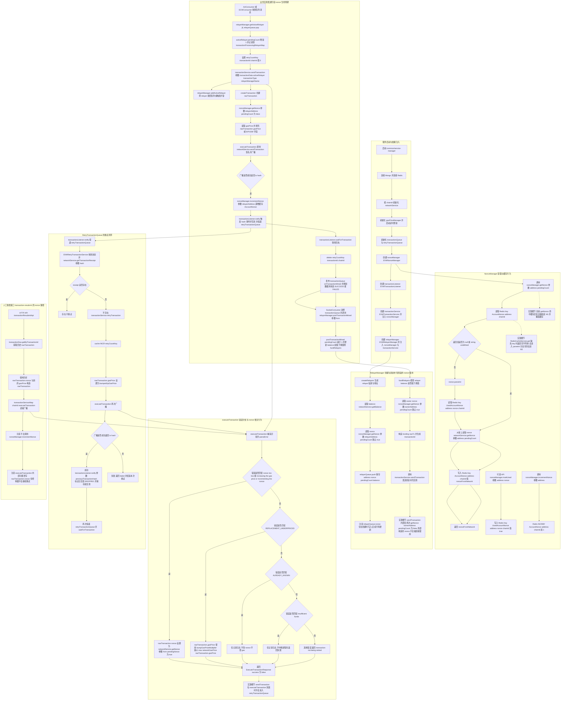

## Nonce 管理与生命周期

本节描述的是 relayer 发送 EVM 交易时使用的 account nonce 生命周期, 覆盖 `nonce-manager` 缓存键设计, nonce 获取策略, 发送成功后的递增, 以及重试和人工重发时的分支行为.

```mermaid
flowchart TD
  %% Nonce lifecycle for relayer EVM tx in this repo

  subgraph S0[服务启动与依赖注入]
    S0A["启动 common/service-manager"]
    S0B["连接 Mongo 并连接 Redis"]
    S0C["按 chainId 初始化 networkService"]
    S0D["初始化 gasPriceManager 并启动定时更新"]
    S0E["初始化 transactionQueue 与 retryTransactionQueue"]
    S0F["创建 nonceManager EVMNonceManager"]
    S0G["创建 transactionListener EVMTransactionListener"]
    S0H["创建 transactionService EVMTransactionService 并注入 nonceManager"]
    S0I["创建 relayerManager EVMRelayerManager 并注入 nonceManager 与 transactionService"]
    S0A --> S0B --> S0C --> S0D --> S0E --> S0F --> S0G --> S0H --> S0I
  end

  subgraph S1[NonceManager 获取与缓存行为]
    N0["调用 nonceManager.getNonce 参数 address pendingCount"]
    N1["读取 Redis Key AccountNonce address chainId"]
    N2{"返回值是否为 null 或 string undefined"}
    N3["nonce parseInt"]
    N4["读取 Redis Key UsedAccountNonce address nonce chainId"]
    N5["从链上读取 nonce networkService.getNonce 参数 address pendingCount"]
    N6["写入 Redis Key AccountNonce address chainId 值 nonceFromNetwork"]
    N7["返回 nonceFromNetwork"]

    N0 --> N1 --> N2
    N2 -- 否 --> N3 --> N4 --> N5 --> N6 --> N7
    N2 -- 是 --> N5 --> N6 --> N7

    N8["可选 API nonceManager.markUsed 参数 address nonce"]
    N9["写入 Redis Key UsedAccountNonce address nonce chainId 值 true"]
    N10["调用 nonceManager.incrementNonce 参数 address"]
    N11["Redis INCRBY AccountNonce address chainId 加 1"]
    N8 --> N9
    N10 --> N11

    N12["实现细节 目前 getNonce 命中缓存后也会继续走 N5 并覆盖缓存"]
    N13["实现细节 RedisCacheService.get 缺失 key 时返回空字符串 会进入 parseInt 分支但仍会走 N5"]
    N0 -.-> N12
    N1 -.-> N13
  end

  subgraph S2[RelayerManager 创建与资金补充阶段的 nonce 使用]
    R0["createRelayers 生成 relayer 私钥与地址"]
    R1["读取 balance networkService.getBalance"]
    R2["读取 nonce nonceManager.getNonce 参数 relayerAddress pendingCount 默认 true"]
    R3["relayerQueue.push 保存 address nonce pendingCount balance"]
    R4["注意 relayerQueue.nonce 仅在创建时写入 后续不再更新"]

    F0["fundRelayers 检查 relayer balance 是否低于阈值"]
    F1["读取 owner nonce nonceManager.getNonce 参数 ownerAddress pendingCount 默认 true"]
    F2["构造 funding rawTx 并生成 transactionId"]
    F3["调用 transactionService.sendTransaction 发送资金补充交易"]
    F4["实现细节 sendTransaction 内部会再次 getNonce ownerAddress pendingCount 为 false 外部构造的 nonce 不会被直接使用"]

    R0 --> R1 --> R2 --> R3 --> R4
    F0 --> F1 --> F2 --> F3 --> F4
  end

  subgraph S3[业务交易发送阶段 nonce 生命周期]
    C0["AAConsumer 或 SCWConsumer 收到队列消息"]
    C1["relayerManager.getActiveRelayer 从 relayerQueue.pop"]
    C2["activeRelayer.pendingCount 增加 1 并记录到 transactionProcessingRelayerMap"]
    C3["设置 retryCountKey transactionId chainId 值 0"]
    C4["transactionService.sendTransaction 参数 transactionData activeRelayer transactionType relayerManagerName"]
    C5["relayerManager.addActiveRelayer 将 relayer 放回队列或触发扩容"]

    T0["createTransaction 创建 rawTransaction"]
    T1["nonceManager.getNonce 参数 relayerAddress pendingCount 为 false"]
    T2["读取 gasPrice 并填充 rawTransaction.gasPrice 或 EIP1559 字段"]
    T3["executeTransaction 调用 networkService.sendTransaction 签名并广播"]
    T4{广播是否成功返回 tx hash}
    T5["nonceManager.incrementNonce 参数 relayerAddress 递增缓存 AccountNonce"]
    T6["transactionListener.notify 触发 hash 事件并写库 并投递 retryTransactionQueue"]
    T7["transactionListener.waitForTransaction 等待回执"]
    T8["delete retryCountKey transactionId chainId"]
    T9["发布 transactionQueue onTransactionMined 并更新数据库状态 SUCCESS 或 FAILED"]
    T10["SocketConsumer 消费 transactionQueue 并调用 relayerManager.postTransactionMined 参数 from"]
    T11["postTransactionMined pendingCount 减少 1 并更新 balance 如低于阈值则 fundRelayers"]

    C0 --> C1 --> C2 --> C3 --> C4 --> C5
    C4 --> T0 --> T1 --> T2 --> T3 --> T4
    T4 -- 是 --> T5 --> T6 --> T7 --> T8 --> T9 --> T10 --> T11
  end

  subgraph S4[executeTransaction 错误分支与 nonce 相关行为]
    E0["executeTransaction 捕获异常并 parseError"]
    E1{"错误是否匹配 nonce too low 或 increasing the gas price or incrementing the nonce"}
    E2["rawTransaction.nonce 设置为 networkService.getNonce 参数 from pendingNonce 为 true"]
    E3{错误是否匹配 REPLACEMENT_UNDERPRICED}
    E4["rawTransaction.gasPrice 使用 bumpGasPriceMultiplier 乘以 max networkGasPrice rawTransaction.gasPrice"]
    E5{错误是否匹配 ALREADY_KNOWN}
    E6["仅记录日志 不改 nonce 不改 gas"]
    E7{错误是否匹配 insufficient funds}
    E8["仅记录日志 不中断进程但返回失败"]
    E9["其他错误 返回 transaction not being retried"]
    E10["返回 ExecuteTransactionResponse success 为 false"]

    E0 --> E1
    E1 -- 是 --> E2 --> E10
    E1 -- 否 --> E3
    E3 -- 是 --> E4 --> E10
    E3 -- 否 --> E5
    E5 -- 是 --> E6 --> E10
    E5 -- 否 --> E7
    E7 -- 是 --> E8 --> E10
    E7 -- 否 --> E9 --> E10

    E11["实现细节 sendTransaction 在 executeTransaction 失败时不会进入 retryTransactionQueue"]
    E10 -.-> E11
  end

  subgraph S5[RetryTransactionQueue 的重试闭环]
    Q0["transactionListener.notify 投递 retryTransactionQueue"]
    Q1["EVMRetryTransactionService 收到消息并 networkService.getTransactionReceipt 参数 hash"]
    Q2{receipt 是否存在}
    Q3["存在 不重试"]
    Q4["不存在 transactionService.retryTransaction"]
    Q5["cache INCR retryCountKey"]
    Q6["rawTransaction.gasPrice 设置为 bumpedUpGasPrice"]
    Q7["executeTransaction 再次广播"]
    Q8{广播是否成功返回 tx hash}
    Q9["成功 transactionListener.notify 参数 previousTransactionHash 标记旧交易 DROPPED 并保存新交易"]
    Q10["再次投递 retryTransactionQueue 并 waitForTransaction"]
    Q11["失败 返回 failed 并结束本次重试"]

    Q0 --> Q1 --> Q2
    Q2 -- 是 --> Q3
    Q2 -- 否 --> Q4 --> Q5 --> Q6 --> Q7 --> Q8
    Q8 -- 是 --> Q9 --> Q10
    Q8 -- 否 --> Q11
  end

  subgraph S6[人工重发接口 transaction-resubmit 的 nonce 路径]
    M0["HTTP API transactionResubmitApi"]
    M1["transactionDao.getByTransactionId 获取历史 rawTransaction"]
    M2["使用历史 rawTransaction.nonce 与新的 gasPrice 构造 rawTransaction"]
    M3["transactionSerivceMap chainId executeTransaction 直接广播"]
    M4["注意 不会调用 nonceManager.incrementNonce"]
    M5["注意 executeTransaction 内部可能改写 rawTransaction.nonce 但控制器不会继续重试"]
    M0 --> M1 --> M2 --> M3 --> M4 --> M5
  end

  %% Cross links for clarity
  S0F --> N0
  S0I --> R0
  C4 --> E0
  Q7 --> E0
  M3 --> E0
  T6 --> Q0
  T9 --> T10
  T11 --> F0
```

