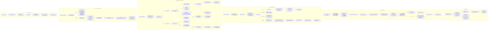

# rrelayer 项目介绍

## Nonce 管理说明

本节聚焦 transaction nonce management 的完整生命周期. 内容来自 `crates/core/src/transaction/nonce_manager.rs` 与 `crates/core/src/transaction/queue_system/*` 及相关 DB 写入逻辑.

```mermaid
flowchart TD
  %% NOTE: all node labels use Chinese words but only ASCII punctuation

  subgraph S0["启动阶段 启动与重建"]
    S0A["startup_transactions_queues 加载 relayer 列表"]
    S0B["从 DB 重建队列<br/>PENDING 队列按 nonce 顺序<br/>INMEMPOOL 队列重建竞争关系<br/>MINED 交易放入 map"]
    S0C["读取链上 nonce evm_provider.get_nonce"]
    S0D["创建 TransactionsQueue<br/>NonceManager.new(current_nonce)"]
    S0E["启动后台循环<br/>pending processor<br/>inmempool processor<br/>mined processor"]
    S0A --> S0B --> S0C --> S0D --> S0E
    S0B --> S0B1["重建竞争交易规则<br/>基于 cancelled_by_transaction_id 关联<br/>若 competitor.is_noop 或 value=0 且 data 为空 则视为 Cancel<br/>否则视为 Replace"]
  end

  subgraph S1["入队阶段 新交易分配 nonce"]
    S1A["API handle_send_transaction or SDK 调用"]
    S1A1["鉴权与网络权限校验<br/>可选 rate limit 预留<br/>若 blobs 存在 需网络允许 enable_sending_blobs"]
    S1A2["构造 TransactionToSend.new<br/>生成 TransactionId.new<br/>speed 默认 FAST<br/>blobs 字符串转换为 TransactionBlob"]
    S1B["TransactionsQueues.add_transaction"]
    S1C["读链上 nonce transactions_queue.get_nonce"]
    S1D["NonceManager.sync_with_onchain_nonce<br/>仅当 onchain > internal 才更新"]
    S1E["NonceManager.get_and_increment<br/>返回 assigned_nonce 然后 internal nonce 加 1"]
    S1F["创建 Transaction<br/>status=PENDING<br/>nonce=assigned_nonce<br/>known_transaction_hash 预计算"]
    S1G["估算 gas 并校验余额<br/>注意: 估算时临时使用 current_onchain_nonce 而不是 assigned_nonce"]
    S1H["DB.save_transaction<br/>写 relayer.transaction 和 audit_log"]
    S1I["队列 add_pending_transaction"]
    S1J["cache invalidate transaction"]
    S1K["可选 webhook on_transaction_queued"]
    S1A --> S1A1 --> S1A2 --> S1B --> S1C --> S1D --> S1E --> S1F --> S1G
    S1G -->|成功| S1H --> S1I --> S1J --> S1K
    S1G -->|失败| S1G1["DB.transaction_failed_on_send<br/>插入 transaction 与 audit_log<br/>failed_at 和 failed_reason 记录<br/>nonce 已经在 NonceManager 中递增 不回滚"] --> S1J
  end

  subgraph S2["pending 阶段 发送与错误恢复"]
    S2A["pending processor 循环"]
    S2A1["若 relayer.paused=true<br/>返回 RelayerPaused 并等待约 30000ms"]
    S2B["取队首 pending 交易"]
    S2C["若 expires_at 已过期<br/>将交易改写为 noop<br/>to=self value=0 data 为空 gas_limit=21000 speed=FAST is_noop=true"]
    S2D["send_transaction"]
    S2E["发送成功"]
    S2F["move_pending_to_inmempool<br/>status=INMEMPOOL<br/>hash sent_at sent_with_gas 写入内存队列"]
    S2G["DB.transaction_sent<br/>status=INMEMPOOL<br/>hash sent_at sent_with_gas sent_with_blob_gas"]
    S2H["可选 webhook on_transaction_sent"]
    S2I["发送失败 gas price too high<br/>保持 pending 并延迟重试"]
    S2J["发送失败 余额不足或类似错误<br/>DB.update_transaction_failed<br/>从 pending 队列移除"]
    S2K["发送失败 nonce too low or invalid nonce or already known"]
    S2L["recover_nonce_synchronization<br/>读链上 nonce 与 internal nonce 对比<br/>NonceManager.sync_with_onchain_nonce"]
    S2M["为该 pending 交易重新分配 nonce<br/>NonceManager.get_and_increment"]
    S2N["更新队列内 pending 交易 nonce"]
    S2O["DB.transaction_update_nonce 写回 nonce 并写 audit_log"]
    S2P["返回 NonceSynchronized 并短延迟重试"]
    S2A --> S2A1 --> S2B --> S2C --> S2D
    S2D -->|成功| S2E --> S2F --> S2G --> S2H
    S2D -->|GasPriceTooHigh| S2I
    S2D -->|InsufficientFunds| S2J
    S2D -->|NonceError| S2K --> S2L --> S2M --> S2N --> S2O --> S2P
  end

  subgraph S3["inmempool 阶段 监控 gas bump 与竞争交易"]
    S3A["inmempool processor 循环"]
    S3B["取队首 inmempool 交易<br/>若存在 competitor 则 active=competitor 否则 active=original"]
    S3C["按 known_transaction_hash 拉取 receipt"]
    S3D["receipt 存在"]
    S3E["move_inmempool_to_mining 解析竞态"]
    S3F["winner 放入 mined map 并从 inmempool 队列 pop"]
    S3G["winner_status=MINED 或 FAILED"]
    S3H["若存在 loser 则仅更新 DB 状态<br/>loser 不进入 mined 队列"]
    S3I["DB.transaction_mined 或 DB.update_transaction_failed"]
    S3J["可选 webhook on_transaction_mined or on_transaction_failed"]
    S3K["receipt 不存在"]
    S3L["判断 gas cap 或 blob gas cap"]
    S3M["若达到 cap 则跳过 gas bump<br/>保持 StillInmempool"]
    S3N["若达到 bump 条件 则 send_transaction 重发并抬高 gas"]
    S3O["gas bump 成功<br/>更新队列内 gas 字段与 sent_at"]
    S3P["注意: gas bump 时 send_transaction 通常跳过 DB 更新"]
    S3Q["gas bump 发送遇到 nonce error"]
    S3R["recover_nonce_synchronization 同 pending 逻辑"]
    S3S["为该 inmempool 交易分配新 nonce 并写回队列与 DB"]
    S3A --> S3B --> S3C
    S3C -->|Some| S3D --> S3E --> S3F --> S3G --> S3I --> S3J
    S3G --> S3H
    S3C -->|None| S3K --> S3L -->|cap| S3M
    S3L -->|not cap| S3N -->|成功| S3O --> S3P
    S3N -->|NonceError| S3Q --> S3R --> S3S

    S3E --> S3E1["竞态分支 1<br/>original mined<br/>winner=original loser=competitor status=DROPPED"]
    S3E --> S3E2["竞态分支 2 Cancel<br/>competitor mined<br/>original 变为 CANCELLED 且 is_noop=true to=self value=0 data 为空<br/>cancelled_by_transaction_id=competitor.id"]
    S3E --> S3E3["竞态分支 3 Replace<br/>competitor mined<br/>original 变为 REPLACED"]
  end

  subgraph S4["cancel or replace API 产生竞争交易"]
    S4A["API cancel or replace 请求"]
    S4B["定位 editable 交易<br/>在 pending 或 inmempool"]
    S4C["若 pending<br/>cancel: status=CANCELLED 并从 pending 队列移除 然后 DB.transaction_update<br/>replace: 仅改写交易内容并触发 webhook<br/>这一路径不创建同 nonce competitor 且不触碰 NonceManager"]
    S4D["若 inmempool<br/>创建 competitor 交易"]
    S4E["competitor.nonce = original.nonce<br/>gas_limit 取原值并加 20 percent<br/>gas 取原 sent_with_gas 并 bump 20 percent<br/>speed=SUPER"]
    S4F["发送 competitor 交易并置 status=INMEMPOOL"]
    S4G["加入竞争结构 add_competitor_to_inmempool_transaction"]
    S4H["更新 original.cancelled_by_transaction_id=competitor.id 但保留 original status=INMEMPOOL"]
    S4I["可选 webhook<br/>on_transaction_cancelled or on_transaction_replaced<br/>并对 competitor 触发 on_transaction_sent"]
    S4A --> S4B
    S4B -->|pending| S4C
    S4B -->|inmempool| S4D --> S4E --> S4F --> S4G --> S4H --> S4I
  end

  subgraph S5["mined 阶段 确认与结束"]
    S5A["mined processor 循环"]
    S5B["取 mined map 任意一笔交易"]
    S5C["等待 elapsed > blocks_every_ms * confirmations"]
    S5D["再次拉取 receipt"]
    S5E["DB.transaction_confirmed status=CONFIRMED confirmed_at"]
    S5F["队列 move_mining_to_confirmed 从 mined map 移除"]
    S5G["可选 webhook on_transaction_confirmed"]
    S5A --> S5B --> S5C --> S5D --> S5E --> S5F --> S5G
  end
```

