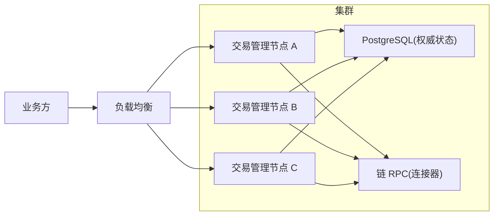
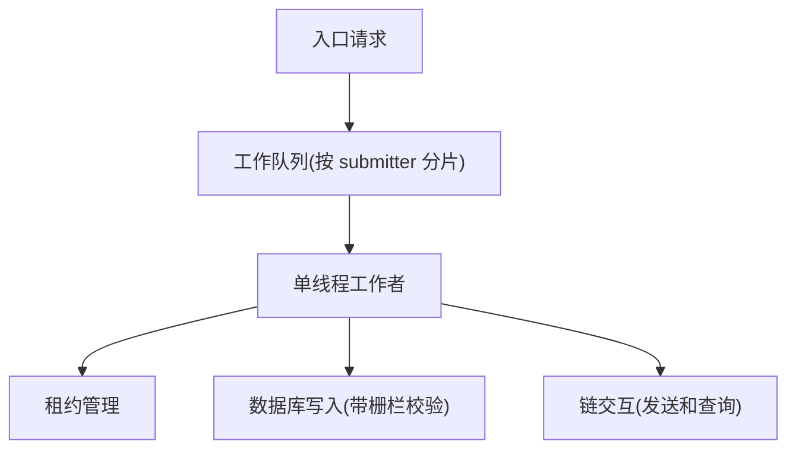
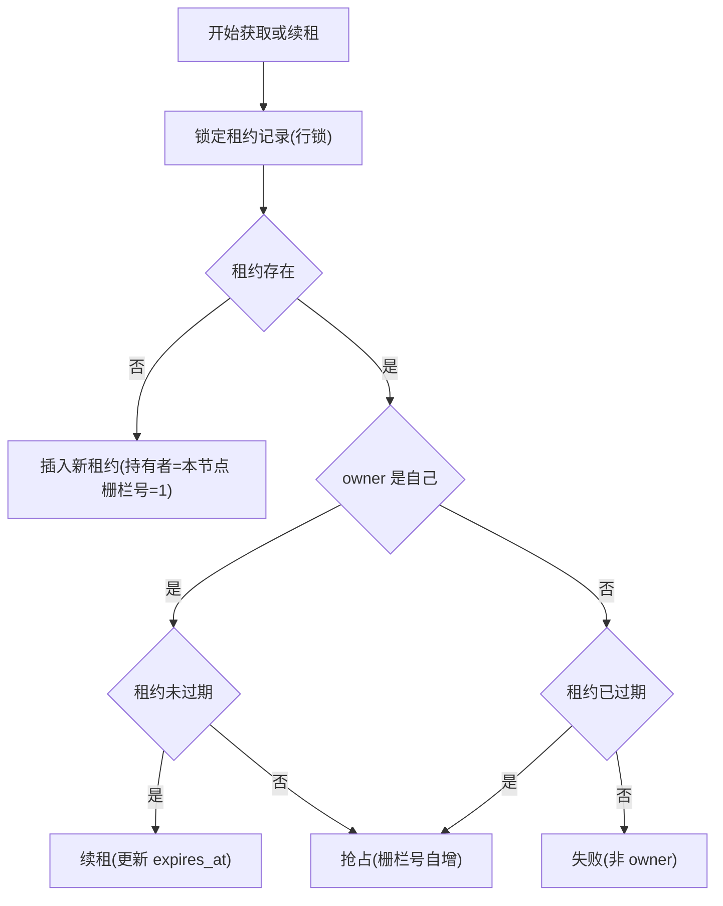
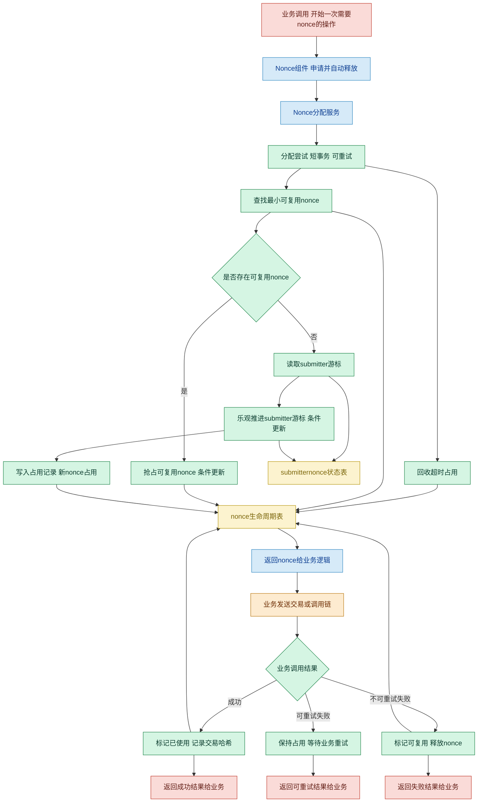
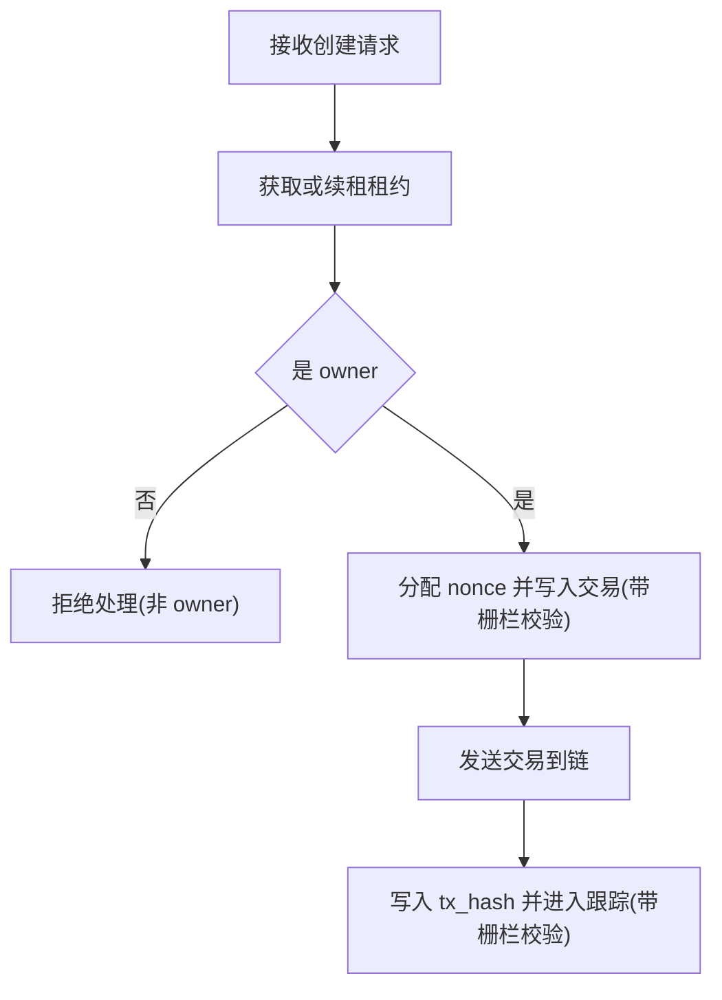

## Nonce Management 设计说明

把系统拆成两层：

1. **路由层**：尽量把 signer 请求打到“应负责的节点”（性能）
2. **执行权层**：最终以“租约与 fencing”决定谁能对该 signer 做关键写入（正确性）

## 目标

### 1 目标
- 多实例环境下, 对同一 submitter 提供全局串行化的关键写入能力
- 关键写入具备硬性隔离能力(旧节点写入必须失败)
- 交易生命周期可追踪: 分配 nonce, 写入 txHash, receipt 落库, 终局推进, 卡住治理
- 组件边界清晰, 允许后续演进(例如 终局确认, 分叉处理, 严格连续模式)

---

## 3. 总体架构

### 3.1 架构总览

设计原则: 负载均衡仅负责转发流量, 不参与正确性. 正确性由 PostgreSQL 的执行权与栅栏机制保证.

### 3.2 节点内并发模型

节点内串行化用于降低数据库冲突与便于批处理, 但不作为唯一正确性依赖.

---

## 5. 核心机制

### 5.1 执行权: 租约与栅栏

#### 5.1.1 抢占与续租流程

约束: 过期判断使用数据库时间, 避免依赖本地时钟.

#### 5.1.2 栅栏写入规则

所有关键写入必须携带以下校验:
- owner_node 等于当前节点
- expires_at 大于当前数据库时间
- fencing_token 等于本次持有的栅栏号

若更新影响行数为 0, 视为被栅栏拒绝, 当前节点必须停止对该 submitter 的推进, 由新 owner 接管.

### 5.2 Nonce 分配: 条件更新 + 唯一约束 + 超时回收

关键点:
- next_local_nonce 通过条件更新(比较后更新)保证不重号
- allocation 表唯一约束保证不会重复占号
- markUsed 与 markRecyclable 要求 lock_owner 匹配, 防止超时回收后的迟到回写污染状态

状态名对照(便于与库字段对齐):
- 预留 = RESERVED
- 已使用 = USED
- 可复用 = RECYCLABLE

---

## 6. 交易生命周期

### 6.1 状态机

当前仓库交易状态包含:
- 已分配(ALLOCATED): 已分配 nonce
- 跟踪中(TRACKING): 已持有 tx_hash, 等待回执
- 终局成功(CONFIRMED): 达到终局条件
- 终局失败(FAILED_FINAL): 链上执行失败且已可判定为终局
- 需要治理(STUCK): 长时间无法推进, 需要人工或策略介入

### 6.2 创建与提交(概念流程)

说明: 当前仓库 txmgr 部分以 service 形态提供写入与提交示例, 对外 API 形态在后续演进中补齐.

### 6.3 ReceiptChecker

目标: 异步查询回执. 查不到回执时不阻塞队列; 出错时逐步延长等待再重试.
- 扫描条件: TRACKING 且 receipt 为空
- receipt 为 null 视为查不到回执(可能尚未上链或节点未同步), 记录检查时间并延迟重试
- receipt 获取成功后仅落库, 终局推进交给 FinalityManager

### 6.4 ResubmitScheduler

目标: 长时间未确认时, 重发同 nonce 的交易, 并避免多节点重复执行外部动作.
- 先在数据库中占位(推进 next_resubmit_at, 带栅栏校验), 再发送链上请求
- 提交成功后写回 tx_hash 或更新重试信息(带栅栏校验)
- 超过最大尝试次数后进入卡住决策

### 6.5 FinalityManager

目标: 将回执推进到终局状态, 并提供最小链重组检测能力.
- 可选 终局确认判定(例如按确认数, 链实现支持时)
- 可选 链重组检测(链实现支持按高度查询区块哈希时)
- 终局写入必须带栅栏校验

### 6.6 卡住治理(StuckResolution)

目标: 提供统一治理入口, 支持业务注入 hook 决策.
- 默认策略不自动取消或替换, 仅延迟或继续尝试
- 若业务选择补救动作, 系统先在数据库中占位再执行发送, 且关键写入仍带栅栏校验

---

## 7. 故障与竞态场景

| 场景                              | 风险                 | 设计处理                                                     |
| --------------------------------- | -------------------- | ------------------------------------------------------------ |
| 故障切换窗口旧节点仍在运行        | 旧节点迟到回写覆盖   | 栅栏写入影响行数为 0, 旧节点无法写入                         |
| 多节点重复重提                    | 重复副作用与写乱状态 | 先在库中占位再发送, 且所有写入带栅栏校验                     |
| 发送灰区(超时但可能已进入 txpool) | 本地缺失 tx_hash     | 预留灰区补齐端口(派生预期 txHash)                            |
| 回执长期不存在                    | 交易长期未确认       | 回执轮询 + 重发 + 卡住治理                                   |
| 链重组                            | 终局判断不稳定       | 最小链重组检测, 不一致进入 STUCK 并等待治理或演进为可回退确认链 |

---

## 8. 可观测性

通过指标端口采集关键事件:
- 租约获取结果(插入, 续租, 抢占, 非 owner)
- 栅栏拒绝次数(按操作区分)
- receipt 查询结果(命中, 未命中, 错误)
- 重提结果(成功, 错误)
- 终局推进结果
- 卡住决策动作
- 队列深度(可选)

日志建议包含: submitter, txId, nodeId, fencing_token.

---

## 9. 演进路线

### 9.1 严格连续模式(single in-flight)

按最终目标设计, 每个 submitter 同时仅允许 1 个 in-flight nonce:
- 创建请求只写入队列态
- 后台按 submitter 串行推进
- 当前 in-flight 被链确认消费后才分配下一个 nonce

### 9.2 黑盒化对外接口

对业务侧仅暴露 txId 与查询接口, 隐藏 nonce 与重试细节:
- CreateTx 返回 txId
- 查询接口返回生命周期状态与可观测信息

### 9.3 可回退确认链与分叉标记

从回执即终局演进到可回退的确认链:
- 确认链列表可覆盖(发生分叉时用新链替换旧链)
- 分叉标记触发下游全量覆盖, 避免拼接两条不同分叉的确认链

### 9.4 数据库迁移管理

引入 Flyway 管理 DDL 与版本演进, 将手工 DDL 迁入 db/migration.

---

## 10. 仓库代码对应关系

- core nonce 模块: `com.work.nonce.core`
  - NonceService, PostgresNonceRepository, NonceComponent
- txmgr 执行权与交易闭环: `com.work.nonce.txmgr`
  - LeaseManager, TransactionWriter, ReceiptChecker, ResubmitScheduler, FinalityManager, StuckResolutionService
- 数据访问: `src/main/resources/mapper/**`

