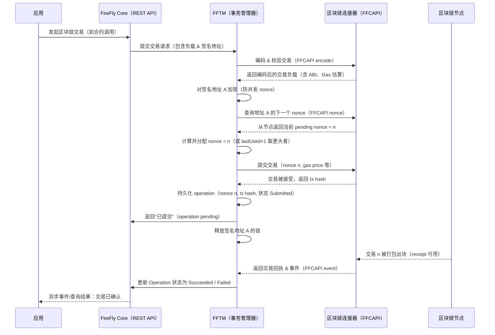
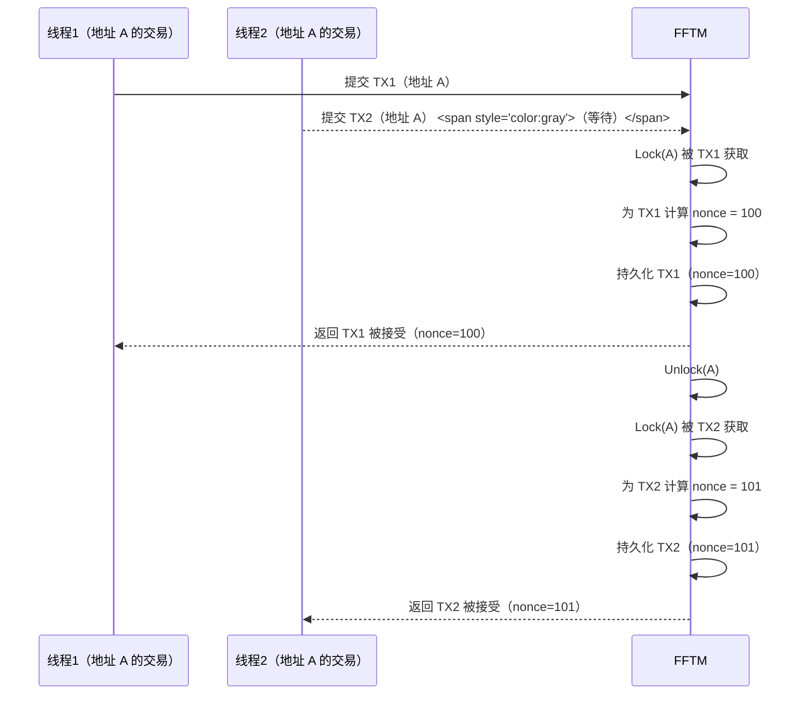
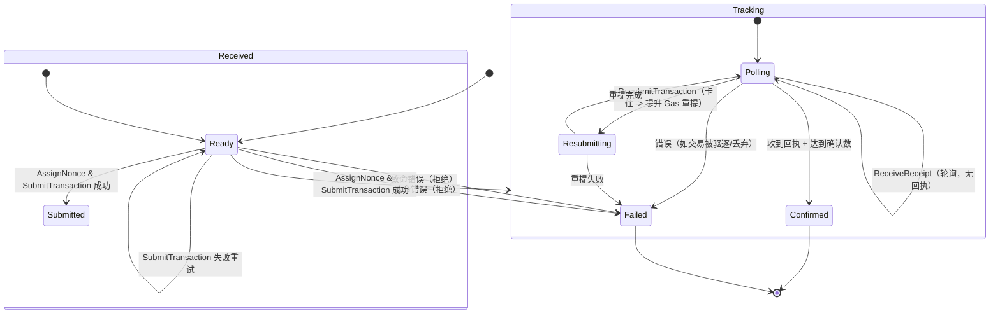
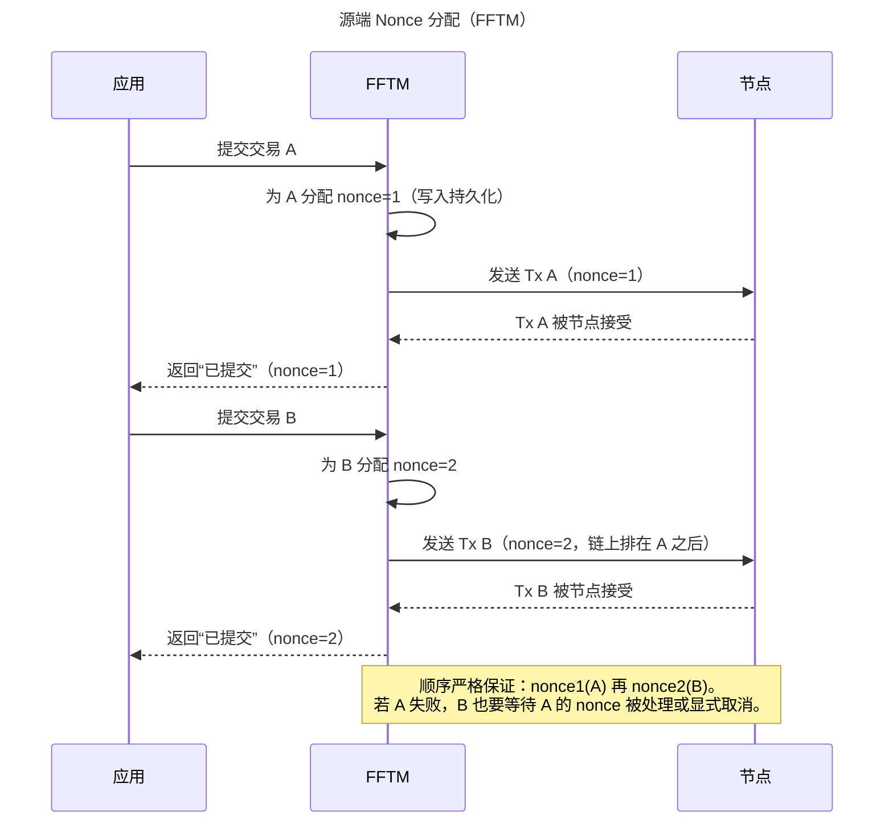
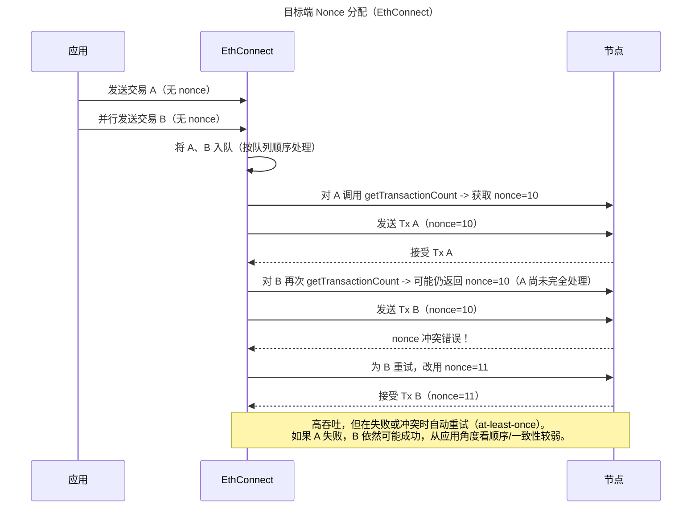

# FireFly 随机数管理（Nonce Management）深度研究（中文版）

> 说明：以下内容是对上一条英文长文的完整技术翻译与整理，结构、段落与重点保持一致，仅将表达转换为中文（保留技术名词如 nonce、FFTM、FFCAPI 等）。

------

## 一、总体概述（High-level Summary）

Hyperledger FireFly 在以太坊账户 **nonce（交易序号）** 管理上，采用了一个强健的 **“源端分配”（at-source）** 策略，该策略内建在 **FireFly Transaction Manager（FFTM）事务管理器** 中。与传统的“目标端分配”（在区块链节点上临时分配 nonce，例如早期的 EthConnect 连接器）不同，FireFly 的 FFTM 会在 **事务通过 API 提交时立刻为其分配 nonce**，即在发送至区块链之前完成。

这样一来，对于某个给定签名密钥（账户）而言，每一笔交易都会严格按顺序排列，并且 **具备幂等性**，即便系统出现崩溃，也能避免重复或跳号。通过持久化记录已分配的 nonce 和交易状态，FireFly 实现了 **“恰好一次”（exactly-once）** 的交易投递语义：重启之后，也不会重用旧 nonce 或跳过未完成的 nonce。

FFTM 同时内置了可插拔的 **Gas 管理与重试模块**，用于优化 gas 价格并处理卡住的交易；并通过一个确认管理器（confirmation manager）追踪交易最终确认情况。所有与区块链的交互都通过标准的 **FireFly Connector API（FFCAPI）** 进行，从而实现 **可插拔的区块链连接器**（如以太坊、Fabric 等）。FFTM 在上层统一处理 nonce 分配、Gas 策略、重提交与事件流等通用逻辑。

总体上，FireFly 的 nonce 管理提供了 **每账户顺序、无缺口的交易序列**、防止并发竞争的控制机制，以及在故障情况下的弹性恢复能力，这为构建可靠的多方协作区块链应用打下了关键基础。

------

## 二、架构说明（Architecture Explanation）

### 1. 组件角色

- **FireFly Core（核心）**
  负责对外提供 REST API 给业务应用，并编排多方工作流（多链、多方、消息、数据等）。涉及区块链交互时，它并不直接与区块链节点通讯，而是通过插件与后端交易管理/连接器交互。
- **FFTM（FireFly Transaction Manager）**
  以独立微服务（或作为连接器的一部分）运行，扮演“事务提交与跟踪引擎”的角色：
  - 分配 nonce
  - 进行签名/提交交易
  - 管理 Gas 与重试
  - 跟踪交易状态与确认
- **区块链连接器（Blockchain Connector）**
  通过 **FFCAPI** 定义的标准接口，处理具体链的 RPC 细节，例如：
  - 以太坊：`eth_getTransactionCount`、`eth_sendTransaction`、`eth_sendRawTransaction`、`eth_getTransactionReceipt` 等
  - 其它链：对应协议的 RPC

### 2. 数据流：REST → FFTM → Connector → Blockchain

当应用通过 FireFly Core 提交一次区块链交易（例如调用合约）时，流程如下：

1. **应用 → FireFly Core**
   发送 REST API 调用（如 “执行智能合约方法 X”）。
2. **FireFly Core → 交易记录**
   在 FireFly Core 自身数据库中创建一个 **Transaction（FireFly 事务上下文）** 和一个类型为 “blockchain invoke” 的 **Operation（操作记录）**。
3. **Core → 区块链插件（FFTM/Connector）**
   Core 将该 Operation 通过区块链插件转发给对应的 FFTM/连接器。
4. **FFTM → FFCAPI**
   - 对交易进行 ABI 编码（`PrepareTransaction`）
   - 估算 Gas
   - 查询 nonce（必要时）
5. **FFTM → nonce 分配 & 持久化**
   - 针对该签名地址加锁
   - 计算下一个 nonce
   - 将交易（地址+nonce+payload 等）写入 FFTM 的持久化存储
6. **FFTM → 连接器 → 区块链节点**
   通过 FFCAPI 的 `SendTransaction` 调用，把包含 nonce、gas 等信息的交易提交到节点。
7. **节点 → FFTM → Core**
   - 节点返回 tx hash
   - FFTM 更新内部状态，并回调/推送到 FireFly Core 更新 Operation 状态
   - 应用可异步收到事件通知，获知交易已提交/已确认等

下面的时序图展示了从应用到链的整体数据流：

### 3. 单例部署与职责边界

- **FFTM 单实例原则**
  通常每个 FireFly「栈」为一组签名密钥部署单一 FFTM 实例，作为 **唯一 nonce 分配源**。
  若 Core 水平扩容，多实例 Core 仍然只通过这一 FFTM/连接器来提交交易，以避免 nonce 冲突。
- **Core vs FFTM 数据职责**
  - FireFly Core：
    - 存储业务级 Transaction 与 Operation
    - 对外提供 REST API 与事件流
  - FFTM：
    - 存储链级交易状态（包括 nonce、tx hash、状态机）
    - 管理 nonce 分配、提交、Gas 重试、确认跟踪
  - Connector：
    - 执行链特定 RPC（打包、签名、事件订阅）

------

## 三、详细 nonce 算法（Detailed Nonce Algorithm）

FireFly 的 FFTM 保证了 **按签名者顺序一致性** 与 **exactly-once 提交**。其核心机制如下：

### 1. “源端分配”（At-Source）策略

FFTM 在 **交易提交流程的最开始** 就为交易分配 nonce：

1. 收到来自 Core 的提交请求。
2. 调用 connector 进行交易编解码和 Gas 估算。
3. **立刻获取/计算 nonce 并分配**。
4. 将分配结果（地址+nonce+payload）持久化。
5. 随后才向节点发送交易。

与之对比，早期 EthConnect 的“目标端分配”是在交易真正发送到节点时、在节点端 `eth_getTransactionCount` 结果基础上分配 nonce——这种方式在高吞吐场景下容易出现并发冲突和重复提交。FireFly 选择“源端分配”，是为了让 **应用提交顺序 = on-chain 执行顺序**，而不是依赖节点处理时机。

### 2. 每地址互斥锁（Per-Address Locking）

为了避免同一地址上的并发提交争抢同一个 nonce，FFTM 使用 **“按签名地址加锁”** 的策略：

- 对每个签名地址维护一个互斥锁（或类似机制），保证在分配 nonce 期间不允许同地址的其他交易同时进入分配逻辑。
- 不同地址之间可以并行处理，因为它们的 nonce 序列互不干扰。

下面的时序图展示了同一地址上两个并发提交的序列化效果：

### 3. nonce 计算逻辑

FFTM 计算下一个 nonce 时，会综合 **本地持久化状态 + 区块链节点状态**：

1. 在自身数据库中缓存/记录某地址已分配的最高 nonce（例如 lastNonce）。
2. 正常情况下，**下一个 nonce = lastNonce + 1**。
3. 为避免与 外部系统（或人工）使用同一账户导致冲突，FFTM 还可以通过配置在必要时 **向节点查询当前 pending nonce**：
   - 调用 `eth_getTransactionCount(address, "pending")` 等。
   - 若节点返回值更高，则以节点值为基准，确保与链上最新状态对齐。

控制“是否查询节点”的核心参数是：
 **`transactions.nonceStateTimeout`**：

- 如果某地址最近一次交易的时间超过该超时时间，则在分配下一个 nonce 前，**强制向节点查询**。
- 若设为 `0`，则 **每笔交易都会查询节点**。
- 在单系统独占账户场景，可以设得稍大；在账户被其他系统共用的情况下，应设小甚至为 0，以尽量减少冲突窗口。

文档中特别强调：**最好不要在 FireFly 之外使用相同的签名密钥**；若必须如此，则通过缩小超时时间降低风险。

### 4. 持久化与幂等（Stateful Persistence & Idempotency）

一旦分配了 nonce，FFTM 会 **立即持久化** 包含该 nonce 的交易记录。这对崩溃恢复和防重复至关重要：

- 即使在分配完 nonce 后立刻崩溃，已分配 nonce 记录仍然存在，下次重启不会重新使用该 nonce。
- 数据库中对 `(signerAddress, nonce)` 设置唯一约束，确保两个交易不可能被写成相同 nonce（即使锁策略失效，数据库约束也会阻止）。
- FireFly Core 一侧，还支持 API 级别的 **幂等键（idempotency key）**：客户端可在请求中带上特定 key，多次提交相同请求时，Core 能识别重复并避免再次下发到 FFTM。

因此，整个路径上实现了：

- 请求层幂等（idempotencyKey）
- nonce 层唯一性与顺序性（FFTM + DB）
- 重启后不会丢失或重复提交

文档明确指出：在有可靠持久化层的前提下，这种“源端分配”方案可以 **防止交易丢失与重复，即便是崩溃恢复场景**。

### 5. 通过 FFCAPI 与节点交互（Target-side Checks）

在 nonce 分配完并持久化后，FFTM 会通过 FFCAPI 的 `SendTransaction` 将交易提交到节点：

- 以太坊场景：
  - 若使用解锁账户：调用 `eth_sendTransaction`
  - 若使用外部签名/预签名：先签名，再调用 `eth_sendRawTransaction`

节点返回结果时，可能出现与 nonce 相关的错误：

1. **Nonce too low（nonce 太低）**
   - 说明该 nonce 已被使用（可能是外部系统或其它原因）。
   - FFTM 会检测错误并重新查询链上 nonce，发现冲突后，通常会将本次交易标记为失败/冲突，而不会强行覆盖。
2. **Nonce too high（nonce 太高 / 中间有缺口）**
   - 说明前面的某个 nonce 对应的交易缺失。
   - FFTM 在设计上不会主动“跳号”分配 nonce，因此一般不会出现这种情况，除非之前的交易被人为删除或 DB 出现异常。
   - 如果出现，节点会将该交易暂时挂起（等待前序 nonce 被填补）。
3. **其它错误**（Gas 不足、交易无效等）
   - 由 **Transaction Handler 策略** 决定如何处理（重试 / 标记失败等），见下节。

### 6. Transaction Handler & Gas 管理

FFTM 内置可插拔的 **Transaction Handler**，整合了签名策略、Gas 定价与重提交逻辑。默认使用的是 **simple handler**，其行为大致如下：

1. **选择 Gas 价格**
   - 支持三种模式：
     - 固定值（fixed）
     - 使用节点默认 / `eth_gasPrice`（connector 模式）
     - 调用外部 Gas Station（oracle 模式）
2. **构造并签名交易**
   - 由连接器根据配置进行账户管理和签名（本地钱包或外部签名服务等）。
3. **提交交易**
   - 调用 FFCAPI 的 `SendTransaction`。
4. **交易卡住时的重提交**
   - 若交易在一定时间内未被打包出块（pending 太久），handler 会 **使用相同 nonce 重新提交**、提升 gas 价格。
   - 配置项 `transactions.handler.simple.resubmitInterval` 控制重提周期（例如 30 秒）。
   - 若节点返回 `"replacement transaction underpriced"`（替代交易 gas 不足以覆盖前一次），handler 继续提升 gas 后再次提交。
5. **重提次数与结束条件**
   - 可多次重试，直到：
     - 交易被打包，得到回执（成功/失败）
     - 达到某种最大重试或超时策略，被标记为最终失败
6. **对外透明性**
   - 对 FireFly Core 和上层应用而言，这些内部重试是透明的：
   - 他们只看到“一笔逻辑操作”，最终结果是成功或失败，而不会看到“多次发送”的细节。

### 7. 子状态状态机（Sub-Status State Machine）

FFTM 为每笔交易维护一个详细的 **子状态（sub-status）状态机** + 行为历史（history）。主要子状态包括：

- **Received**（已接收）
  - 初始状态：FFTM 收到提交请求。
  - 典型动作：
    - `AssignNonce`（分配 nonce）
    - `RetrieveGasPrice`（获取 gas 价格）
    - `SubmitTransaction`（提交交易）
  - 若提交失败（如网络错误），可能在此状态中重试 `SubmitTransaction`。
- **Tracking（Pending）**（跟踪中 / 挂起）
  - 表示交易已成功提交到链上，拥有 tx hash。
  - 典型动作：
    - `ReceiveReceipt`（轮询回执，可能多次）
    - `Confirm`（达到指定确认数后标记确认）
    - 若发生重提交（替换交易），也会记录相关 `SubmitTransaction` 动作。
- **Confirmed（已确认）**
  - 交易被链确认并达到设定的区块确认数，状态终止为成功。
- **Failed（失败）**
  - 交易最终失败（例如回执 status=0 或被视为不可恢复地卡住）。
- **Suspended（挂起）**
  - 可通过管理 API 手动暂停该交易的自动处理。

下面是简化的状态机图：

在 FireFly 的 Operation `history` 中可以看到完整的子状态和操作记录：

- `Received`：`AssignNonce`、`RetrieveGasPrice`、`SubmitTransaction`
- `Tracking`：重复的 `ReceiveReceipt`（如 count=2）和最终的 `Confirm`
- `Confirmed`：终态

`historySummary` 提供压缩视图列出所有可能出现过的子状态和动作类型。从 history 中可以清楚看到：**`AssignNonce` 总是交易处理的最早动作**，进一步印证 FireFly 的“源端分配”设计。

### 8. Exactly-once vs At-least-once

- FireFly FFTM 追求 **exactly-once**：
  - 对每个应用提交的逻辑操作，系统保证不会被“意外发送两次”到链上。
- EthConnect 的“目标端分配”策略则更偏向 **at-least-once**：
  - 出现 nonce 冲突或某些错误时，会自动更换 nonce 重试，这有可能导致应用在极端情况下观察到重复效果。

FireFly 文档明确指出，其设计意图是避免这类“自动修复但有重复风险”的妥协。如果一笔交易最终未获得确认，会以失败告终；若上层希望重试，可以通过幂等键控制，再次提交一个逻辑等效的操作。

#### 对比图：源端 vs 目标端

**源端分配（FFTM）：**

**目标端分配（EthConnect）：**

结论：FFTM 更偏向 **一致性与确定性**；EthConnect 更偏向 **吞吐与自动修复**。FireFly 1.2+ 默认采用 FFTM 方案。

------

## 四、持久化模型（Persistence Model）

FFTM 使用可靠的持久化存储来保存交易状态，以确保恢复能力和顺序性。支持两种后端：

- 本地 **LevelDB**（文件存储）
- 外部 **SQL 数据库（例如 PostgreSQL）**

不论后端如何，数据模型都至少包括一个 **链级交易表/集合**，其主要特点如下：

### 1. 交易记录结构

每笔交易记录包含以下核心字段（概念上）：

- 唯一 ID（可与 FireFly Operation 相关联）
- 签名地址（signer address）
- 分配的 **nonce**
- tx hash（提交成功后获得）
- 交易内容（合约地址、方法、参数、value、gas 等）
- 状态（Received / Tracking / Confirmed / Failed / Suspended 等）
- 创建时间、最后更新时间
- 可能还有对 FireFly Transaction 或 Operation 的引用

一旦 nonce 分配完成，就会立刻写入该记录。

### 2. 唯一性约束

在 SQL 模式下，通常会对 `(signerAddress, nonce)` 创建唯一索引，确保**同一地址同一 nonce 只能有一条记录**。
 即使逻辑锁意外失效，这种约束也能从数据库层防止重复分配。

### 3. 历史 & 子状态记录

FFTM 在交易记录上附带一套 **子状态历史（history）** ：

- `history`：数组形式，包含多个子状态条目：
  - 每条记录包括：`subStatus`、`time`、`actions[]`
  - `actions` 包含 `type`（例如 `AssignNonce`）、`count`、`lastOccurred`、`info` 等
- `historySummary`：列出该交易生命周期中所有出现过的子状态和动作类型，用于快速概览。

这些历史用于调试和监控，并不会改变核心逻辑。可以通过配置限制最多保留多少条历史记录（例如 `maxHistoryCount`）。

### 4. 批量写入与性能

在使用 SQL 后端时，FFTM 采用 **flush writer** 模式将多条事务写入合并为较少的数据库提交：

- 多个并发交易提交时，FFTM 会将 insert/update 合并到一个批次中提交，以减少数据库开销。
- LevelDB 自然适用于连续写，但缺乏 SQL 的灵活查询能力。

### 5. 索引与查询能力

FFTM 的 SQL 模式支持丰富的查询能力，包括根据地址、状态、nonce 排序等：

- 可按签名地址列出所有交易（并按 nonce 排序）。
- 可筛选 Pending / Confirmed / Failed 交易。

这意味着对应地有索引（如 signer+nonce），同时也证实 nonce 在内部被视作一个重要的排序键。

### 6. 与 Core Operation 的协调

- FireFly Core 的数据库中存储的是高层次的 **Operation** 记录：
  - 状态（pending、succeeded、failed）
  - 少量链相关信息（如最终 tx hash、block number）。
- FFTM 则存储链级的详细状态机和 nonce 信息，而 Core 仅持有汇总视图。
  - FFTM 状态更新时，会通过回调/事件更新 Core 的 Operation。

因此，**FFTM 的持久化是 nonce 与交易处理的“真相源”（source of truth）**，Core 的记录则是供应用查询的简化视图。

### 7. 无缺口（No Gaps）保证

由于 FFTM 始终保留 pending 交易记录直到其 Confirmed/Failed，并通过递增 nonce 分配：

- 对于每个地址，数据库中的 nonce 序列是连续的；
- 即便某笔交易卡住，其对应 nonce 记录仍然存在，不会被跳过；
- 只有在交易被确认为“已经消耗了该 nonce”（无论 success/fail）后，才继续分配下一 nonce。

因此，在 FFTM 管控下，**不会出现“看不见的 nonce 空洞”**。每一个 nonce 都有对应的交易记录。

### 8. LevelDB 与 SQL 的取舍

- **LevelDB** 适合单机轻量部署：
  - 无需额外 DB 服务，部署简单。
  - 但查询能力有限，不方便做复杂的过滤/统计。
- **PostgreSQL** 等 SQL 后端适合生产环境：
  - 支持多实例重启恢复（连接同一个 DB）。
  - 支持复杂查询与 UI 展示。

两者都能保证持久化与顺序性，但企业生产场景更推荐使用 SQL 后端。

------

## 五、崩溃恢复模型（Crash Recovery Model）

FireFly 设计目标之一是：FFTM 或节点崩溃/重启，不影响交易完整性。通过持久化状态及恢复逻辑，实现 **幂等重启**：

### 1. 启动恢复流程

当 FFTM（或连接器服务）重启时，会执行以下步骤：

1. 从数据库加载所有 **未终结（非 Confirmed/Failed）** 的交易。
2. 重新初始化链事件监听（新区块、交易回执等）。
3. 对每一笔 pending 交易，根据其子状态决定下一步：
   - 若状态为 “已提交但无回执”：恢复轮询回执。
   - 若已收到回执但等待确认数：继续等待剩余区块。
   - 若尚未提交（极少见）：尝试提交。
4. 确认管理器会在重启后对所有在跟踪中的交易做一次 `fetchReceipt` 检查。如果这段停机期间节点已经打包了这些交易，将很快收到回执并更新状态。

### 2. 重启下的 Exactly-once 行为

考虑几种典型情况：

1. **分配 nonce 后、尚未发送交易就崩溃**
   - DB 中已有该 nonce 交易记录，但没有 tx hash。
   - 重启后，FFTM 检测到该记录仍处于“未提交”状态，可安全地第一次提交。
   - 链上视角看，这是该 nonce 的首次出现，不会有重复。
2. **发送交易后、在记录 tx hash 前崩溃**
   - 交易可能已被节点接收（在 mempool 内），但 FFTM 未持久化 tx hash。
   - 重启后，FFTM 看到有已分配 nonce、但无提交确认记录。
   - 处理方式：
     - 先向节点查询 pending nonce，发现节点 nonce 已高于本地 state。
     - 这暗示交易可能已发送并进入 mempool，或已被打包。
     - FFTM 可选择等待事件流或回执，若迟迟没有结果，则重新用 **同样的 nonce 和交易内容** 再次提交。
       - 若之前的交易仍在 mempool 中，重复提交相同内容会被节点视为重复（可能返回 “already known”），对最终结果无害。
       - 若之前交易丢失，这次就是补发，仍然是“逻辑上的同一笔”。
   - 从应用角度看，仍是 **一次逻辑操作**，不会产生两笔不同的业务效果。
3. **FFTM 停机期间，节点继续出块**
   - 某些 pending 交易可能被打包。
   - 重启后，通过回执轮询和事件重放，FFTM 会发现这些交易的 Confirmation 并更新状态。
   - 若存在多次重提交的历史，也会在 history 中体现。

### 3. 事件流与 checkpoint

- FFTM 与 Core/应用之间的事件流采用 **“至少一次”投递语义（at-least-once）**：
  - 重启或网络抖动可能导致某些“交易已确认”事件被重复发送。
  - FireFly Core 内部通过唯一 ID 和 Operation 状态判断是否已处理，从而避免产生重复记录。
- FFTM 对事件流使用 **checkpoint（检查点）** 机制：
  - 事件只会在确认一定数目的区块后才被视为 final 并写入 checkpoint。
  - 对于处在“链头不稳定区”的事件，重启时可能被重放，以防 reorg。

这意味着：即便事件有重复，**应用只看到幂等的最终状态**。

### 4. 处理 reorg（链重组）

- FFTM 的确认管理器通过配置 `confirmations.required` 控制所需确认数。
- 在达到确认数之前，若遇到链重组，某笔交易所在 block 从主链中被移除：
  - FFTM 监测到该交易所在 block 不再在主链中，
  - 将交易状态从“已确认临时”退回到“Tracking/Pending”，
  - 继续监控其是否在新链上被 re-insert 或最终被替代。
- 若最终该交易完全消失（未再次被打包），通常节点会将其重新放回 mempool，FFTM 会继续跟踪或最终标记失败。

由于 FireFly 在多方网络中要求所有节点对事件有一致的视图，它会基于确认和 checkpoint 带来一致的最终顺序。

### 5. 智能合约层的幂等建议

文档也提到，最佳实践是让智能合约调用本身具备一定幂等性（或通过特定 key 去重）：

- 即便出现少数重复交易（例如运维或手工操作导致），合约状态层也不会产生不希望的副作用。
- 在 FFTM 的 exactly-once 保证之上，这是额外的一层安全网。

总之，借助持久化的 nonce 记录和在重启后的恢复流程，FFTM 在崩溃恢复场景下仍能保持 **不丢、不重、不乱序** 的交易处理。

------

## 六、故障场景与竞争条件（Failure Scenarios & Race Conditions）

FireFly 在设计时充分考虑了各种失败与并发场景，以防止 nonce 竞争和顺序破坏。

### 1. 多系统共用同一账户（最糟糕的竞争场景）

当 **另一个系统或用户在 FireFly 之外也用同一账户发送交易** 时，会出现典型的 nonce 竞争问题：

- FireFly 强烈建议 **不要** 这样使用：

  > “要特别注意通过 FireFly 流经的签名密钥不要在其他地方使用。”

- 若业务确实必须这么做，则建议：

  - 把 `transactions.nonceStateTimeout` 设成很小甚至 `0`，让 FFTM 每次都从链上拉取当前 nonce。
  - 这样可以显著缩小冲突窗口，但 **不能完全消除** 风险。

- 当两边同时在极短时间内提交时，仍可能发生：

  - 节点先接收外部系统的交易，用掉某个 nonce；
  - FFTM 根据旧状态分配了同一个 nonce；
  - 则 FFTM 提交时会得到 `"nonce too low"` 错误。

- 此时 FFTM 会：

  - 重新向节点查询 nonce，发现该 nonce 已被外部交易占用；
  - 通常将本事务标记为“nonce 冲突/失败”，而不会试图覆盖；
  - 或在策略上用下一个 nonce 重试。这取决于业务配置，但一般不推荐自动跳号。

该场景本质是 **违反“单一 nonce 源”原则** 的结果。FireFly 能提供一定缓解，但无法从根本解决，因此建议架构上避免。

### 2. 交易执行失败（revert）

当某笔交易在 EVM 内部执行时失败（例如 require 失败导致 revert）：

- 该交易仍然会生成回执（receipt），并且 **nonce 已被消耗**。
- FFTM 会把 Operation 标记为 **Failed**，并包含回执中的错误信息。
- 后续 nonce 可以继续正常分配（例如从 5 失败后，分配 6、7 等）。

FireFly 的“顺序保证”是指 **链上执行顺序** 与 **提交顺序** 一致，而不是“所有事务都成功”。这意味着：

- 若 txn5 revert 而 txn6 成功，则系统报告 txn5 失败、txn6 成功；
- 不会回滚 txn6 或做全局一致性补偿，这需业务逻辑自行处理。

这是一种有意识的设计取舍：不让某个失败交易阻塞所有后续业务。

### 3. 交易卡住（Gas 太低 / 未被传播）

当交易长期 pending，可能是因为：

- Gas price 太低，矿工不愿打包；
- 网络抖动导致传播不畅；

FFTM 会通过重提交逻辑提升 Gas 尝试解决：

- 若多次重试仍无效，通常由运维介入，或通过 Suspend/Resume API 手动处理：
  - 暂停该交易的自动处理，
  - 人工使用同一 nonce 发出“取消交易”（例如向自己转 0 ETH，较高 Gas），
  - 然后在 FireFly 中标记该 transaction 为失败，再允许后续交易继续。

FireFly 不会自动“跳过某个 nonce 而继续发后面的交易”，而是倾向保守：宁可停下来让人手干预，也不隐式违反顺序及一致性假设。

### 4. 区块链节点故障/切换

当以太坊节点（RPC）故障或网络不可达时：

- FFCAPI 调用会失败（如 `SendTransaction` 返回错误）。
- FFTM 不会把交易标记为已完成，而是保留在 Received 或 Pending 状态，并周期性重试。
- nonce 仍然被保留，不会释放给其它交易。
- 节点恢复后，FFTM 会继续提交，保证不会丢失交易。

事件监听同样会重连：

- 当节点恢复时，连接器重新订阅区块/事件，重放停机期间漏掉的事件。

### 5. 并发交易与 maxInFlight

配置项 `transactions.handler.simple.maxInFlight` 控制每个地址 **最多有多少笔“已提交但未确认”的交易”可在链上排队**：

- 若设置为 1：
  - 严格串行，FFTM 等待上一笔确认后才发送下一笔。
- 若大于 1：
  - 可以流水线式提交多笔（例如 5 笔），节点会按 nonce 排队执行。

注意：在以太坊上，即便你提交多笔并发交易，它们仍按 nonce 顺序执行：

- 若某个较早 nonce 的交易 A 卡住，后面 nonce 的交易 B、C 也不会被打包，直到 A 被处理（打包或替换）。
- FFTM 的确认管理器会专门关注最早那笔（最小 nonce），通过重提交提升 Gas 尝试推进它。

因此，提高 `maxInFlight` 能提升吞吐，但对“卡住交易”问题并没有根本解决，而是增加了挂起队列的长度。
 合理的值要在吞吐与资源可控之间折中。

### 6. FireFly Core 故障

当 FireFly Core 崩溃而 FFTM 依然运行时：

- FFTM 仍会向链提交交易、监听回执与事件。
- Core 只是暂时无法接收更新，也无法处理新提交。

待 Core 恢复后：

- FFTM/连接器 将重新建立与 Core 的连接，并可通过事件重放或状态查询同步状态。
- Core 可以直接查询 FFTM 中 Operation 的状态（通常由 Connector/FFTM 提供后端接口），确保不会“漏掉中间发生的确认或失败”。

总的来说，由于 FFTM 是 nonce 与链交互的“单一主导者”，Core 的故障不会破坏 nonce 顺序；它只会影响 API 和 UI 层的可用性。

------

## 七、与 nonce 行为相关的配置项（Configuration Parameters）

以下配置项对 nonce 及相关行为有直接影响：

### 1. `transactions.nonceStateTimeout`

- 含义：
  - 上一次针对某地址分配 nonce 的时间距现在超过该值时，分配下一个 nonce 前要先从链上查询当前 pending nonce。
- 典型用法：
  - **0**：每笔交易都查询一次链上 nonce（最保守）。
  - 较大值：FFTMs 批量处理时可减少链查询，性能更好。
- 多系统共用账户时，建议设为 0 或非常小。

### 2. `transactions.handler.simple.maxInFlight`

- 含义：
  - 每个地址可同时在链上 pending 的最大交易数。
- 调整效果：
  - 小值（如 1）：更强的串行语义，问题更易定位。
  - 大值：更高吞吐，但遇到卡住交易时可能挂更多 pending。

### 3. Gas 管理配置（`transactions.handler.simple.*`）

- `gasOracle.mode`：
  - `disabled`：禁用 Gas 预估，使用固定或默认值
  - `connector`：依赖节点默认值（`eth_gasPrice` 等）
  - `restapi`：调用外部 Gas Station 服务（由 `url` 和 `template` 控制）
  - `fixed`：使用静态 Gas 价格
- `simple.fixedGasPrice`：
  - 当 `mode=fixed` 时，用于指定固定 gas 单价。
- `simple.resubmitInterval`：
  - 重提交的间隔；太短会频繁重提，太长则卡住交易等待较久。
- `confirmations.required`：
  - 所需确认的区块数；与“何时认为交易最终成功”直接相关。

此外还有：

- `confirmations.blockCacheSize`、`receiptWorkers` 等：
  - 调整确认管理器的并发度与缓存大小。

### 4. FireFly Core 中的幂等性配置

- Core 中对数据库唯一索引与 API 幂等性的支持：
  - 请求可携带 `idempotencyKey`，Core 确保同一 key 对应同一逻辑操作。

这间接影响 FFTM：重复请求会被 Core 拦截，不会生成重复交易。

### 5. FFCAPI 连接配置

- 在 FireFly Core 配置中，`plugins.blockchain` 区段指定 FFTM/连接器 URL：
  - 例如 `blockchain.connector.url = http://fftm:5102`。
  - 若配置缺失或使用旧 EthConnect，则不会启用新的 FFTM nonce 管理模式。

### 6. 自定义处理器与旧配置兼容

- `transactions.handler.name`
  - 允许使用自定义的 transaction handler 插件（需实现同样的接口）。
- 旧版 EthConnect 使用 `policy.loop` 等配置；在 FFTM 中这些已重命名为 `transactions.handler.simple.*`。

### 7. 事件流相关配置

- 虽然不直接影响 nonce，但与最终一致性密切相关：
  - `eventstreams.batchSize`、`batchTimeout`、`checkpointInterval` 等控制事件批处理与 checkpoint 策略。
  - `chainHeadStability` 用于定义“链头不稳定区块数”，与 `confirmations.required` 一般要协调。

------

## 八、结论（Conclusion）

通过 FFTM，Hyperledger FireFly 在以太坊 nonce 管理上实现了 **完整而严谨的方案**：

- 在 **“源端”分配 nonce 并立即持久化**，保证：
  - 严格顺序
  - 无重复 nonce
  - 崩溃后可恢复，无丢/无多投
- 采用 **单一 FFTM 实例 + 每地址锁 + 唯一性约束** 的结构，确保每个账户的 nonce 序列是由 FireFly 全权掌控的，避免并发竞争和乱序。
- 借助 **Transaction Handler** 和 **确认管理器**：
  - 自动处理 Gas 策略、卡住交易重提、确认等待与 reorg；
  - 将链层复杂度对上层屏蔽，提供类似“数据库事务提交”的使用体验。
- 通过 **持久化状态机与历史记录**：
  - 提供交易生命周期 360° 可观察性（AssignNonce → Submit → ReceiveReceipt → Confirm）。
- 通过 **事件流 at-least-once + Core/合约层幂等性**：
  - 在存在网络抖动、重启、reorg 的情况下，仍能保证应用层不会被重复事件扰乱。

对于开发者和架构师而言，这意味着无需再自行实现复杂、易错的 nonce 跟踪与重试逻辑。FireFly 将常见的“nonce too low”、“replacement underpriced”、“transaction stuck in pending”等以太坊中的顽疾封装在平台内部，以 **确定性、一致性和可恢复性** 的方式交付给业务系统。

简言之：**FireFly 的 nonce 管理为企业级多方区块链应用提供了“恰好一次、有序且具备恢复能力”的交易提交基础设施**，大幅降低了基于以太坊等链构建可靠应用的实现成本与心智负担。