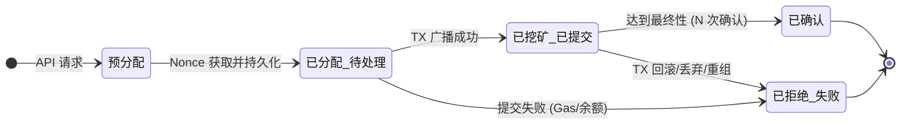
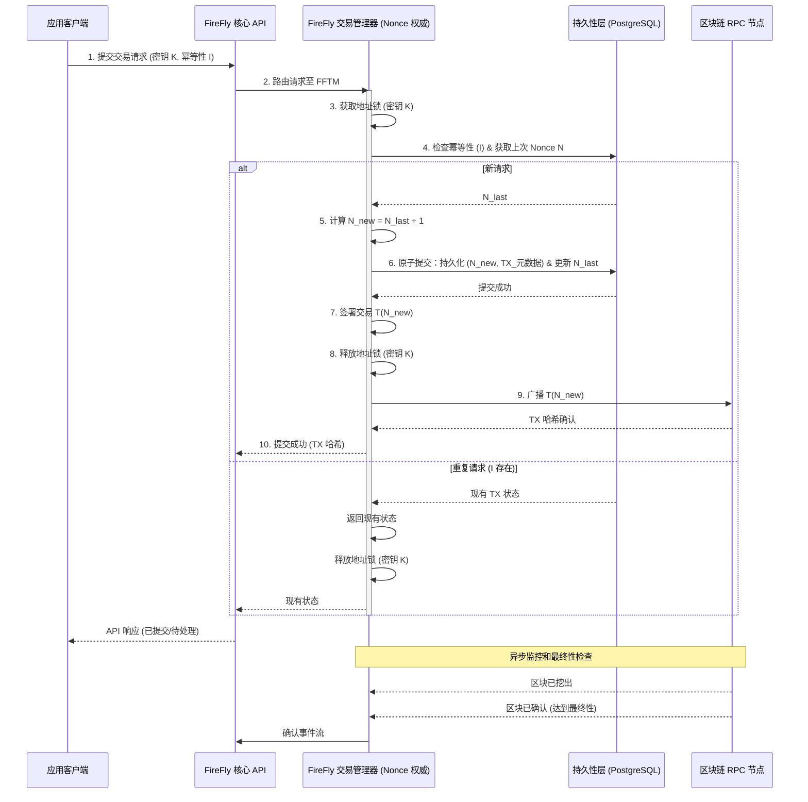
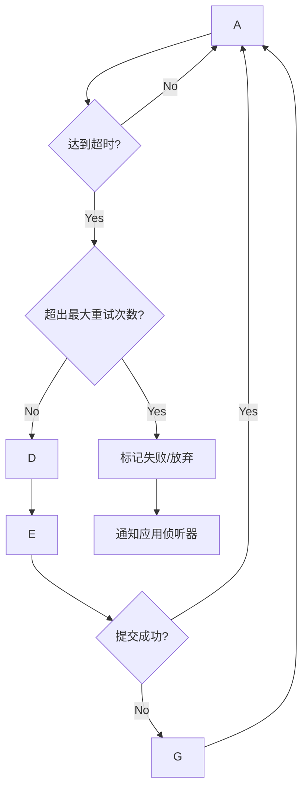
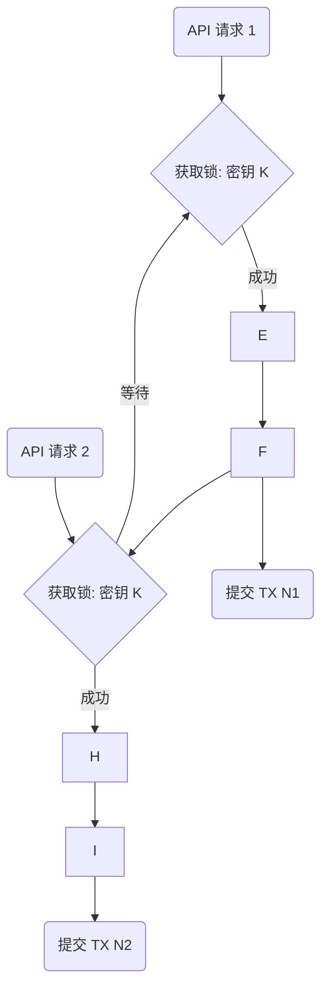
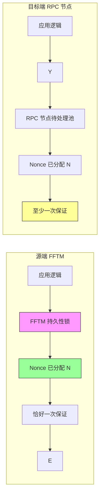

# 超级账本 FireFly 交易编排：源端 Nonce 管理实现的综合研究

## I. 执行摘要：超级账本 FireFly 的可靠交易编排 (FFTM)

超级账本 FireFly (FFTM) 采用了一种高度可靠、有状态的方法对企业去中心化应用进行交易排序。指导其设计的核心架构决策是选择**“源端” Nonce 分配模型**，该模型在 FireFly 交易管理器 (FFTM) 内部进行严格管理 1。这种方法将排序责任集中化，并为交易排序的完整性和恰好一次交付 (exactly-once delivery) 提供了最严格的保证，这对于高价值的业务操作至关重要 2。

FFTM 作为应用程序业务逻辑和底层区块链之间的权威排序层。其可靠性建立在三个基本支柱之上：有状态的持久性，可实现强大的崩溃恢复；通过**每签名密钥序列化**实现的严格并发控制；以及处理重新提交和动态 Gas 优化的策略驱动型交易生命周期管理引擎 1。这种架构提供了必要的可靠性保证，但也施加了一个关键的结构约束：针对特定签名地址的所有交易提交必须**专属地**流经负责该地址的 FFTM 实例，以维护状态完整性并避免 Nonce 冲突 1。

## II. 架构背景：FireFly 交易管理器 (FFTM)

### A. 超级账本 FireFly 微服务架构

超级账本 FireFly 被设计为一个开源中间件或 Web3 编排引擎，通过将传统系统连接到去中心化网络来简化安全的应用程序开发 4。

该架构由多个可插拔组件组成。FireFly Core 充当中央编排器，管理简化的 REST API 接口、内部消息排序和整体状态协调 4。与特定区块链技术的交互通过连接器层进行抽象。

**FireFly 连接器框架 API (FFCAPI)** 提供了一个解耦、轻量级的接口，用于集成各种区块链协议。该框架要求受支持的区块链遵循基本原则：存在签名交易、可选的 Gas 语义、连续的数字区块、确定性事件（日志），以及表达交易最终性（确认数）的明确机制 1。

### B. FFTM 作为交易排序权威机构的角色

FireFly 交易管理器 (FFTM) 是基于 Go 语言的连接器工具包的核心组件 1。它在逻辑上位于 FireFly Core 和原始区块链节点 RPC 接口之间运行，充当专用的排序权威机构。

FFTM 的职责超越了简单的交易中继，涵盖了复杂的生命周期管理功能，包括：

1. **Nonce 管理：** 幂等性提交和 Nonce 的权威分配 1。
2. **交易管理：** 预签名功能、重新提交策略实现和交易历史跟踪 1。
3. **Gas 管理：** 与 Gas 站 API 集成以及用于动态费用设置的可定制策略引擎 1。
4. **监控：** 跟踪区块链操作、收据和所需的确认数 1。

将 Nonce 管理分配给 FFTM 的架构含义是 Noncing 权限的集中化。为了让系统保证交易可靠性和严格排序，FFTM 必须是管理任何给定签名密钥 Nonce 的**唯一**系统 1。这意味着，尽管 FireFly 架构支持分布式应用程序，但关键的状态管理元素（Nonce 序列）被特意序列化并集中在负责该密钥的 FFTM 实例中 。

### C. 交易提交数据流

交易流强调早期、权威的 Nonce 分配和解耦的监控，从而在不牺牲最终性保证的前提下，实现响应迅速的应用程序交互。

1. **REST API 摄取：** 应用程序通过 FireFly Core API 提交交易请求。
2. **核心处理和路由：** FireFly Core 将请求路由到与区块链和命名空间相关的 FFTM 实例 。
3. **FFCAPI 验证：** FFTM 区块链连接器验证交易有效载荷结构有效，并能成功为目标链编码 2。
4. **Nonce 分配（临界区）：** 启动核心流程，涉及并发保护和有状态持久性，从而分配下一个连续的 Nonce 并将其内部记录 2。
5. **交易签名和提交：** 使用分配的 Nonce 对交易进行加密签名，然后广播到区块链 RPC 节点。
6. **异步确认：** 交易监控过程开始。提交的 API 响应在最终确认**之前**发生。确认事件仅在达到必要的区块最终性阈值后，才会流式传输给应用程序侦听器 2。这种设计选择有效地将面向用户的延迟与区块链确认时间不可预测的性质解耦。

## III. Nonce 分配策略：“源端”模型以确保恰好一次交付

### A. 源端分配的原理

超级账本 FireFly 采用“源端” Nonce 分配方法，即 Nonce 在传输到目标区块链**之前**，在 FFTM 中间件内部被分配并持久化 1。

这种设计选择提供了最严格的交易顺序保证 1。通过在应用程序中间件层协调排序，顺序被确定性地锁定。至关重要的是，“源端”方法支持**幂等性提交和恰好一次交付保证** 2，即使在发生严重的崩溃恢复场景时，只要持久化层可靠，也能防止交易丢失和重复。

### B. 关键比较：源端 vs. 目标端

FireFly 采用“源端”模型的决定，意味着它有意放弃了EthConnect 等更简单连接器中常用的“目标端”策略 1。

“目标端”模型通过允许 Nonce 在提交时由区块链节点的待处理池确定和分配来优化吞吐量。虽然这有助于自动交易恢复和高吞吐量，但它引入了对于企业完整性而言不可接受的重大折衷 2。

“目标端”模型的主要折衷在于其保证级别，通常是**至少一次交付** (at-least-once delivery) 1，而不是 FFTM 所要求的严格恰好一次。此外，如果单个交易失败，“目标端”方法通常允许随后的、更高 Nonce 的交易流式传输到链上。虽然这优化了吞吐量，但却破坏了严格的排序保证，可能导致高价值或敏感交易流程在链上的相关业务逻辑执行顺序错乱 1。

表：比较：源端 vs. 目标端 Nonce 分配

| **功能** | **“源端” (FFTM)** | **“目标端” (RPC 节点/简单连接器)** |
| --- | --- | --- |
| **分配点** | 中间件层 (FFTM 持久化)。 | 区块链节点待处理池 (RPC 调用)。 |
| **排序保证** | 严格，由应用程序逻辑保证。 | 降低；即使前一个 TX 失败，后续 TX 也会继续。 |
| **交付保证** | 恰好一次交付（通过有状态持久性）。 | 至少一次交付 。 |
| **崩溃恢复锚点** | FFTM 内部持久化状态 。 | 外部区块链节点状态 (RPC 查询)。 |
| **主要架构目标** | 可靠性、确定性排序、企业保证。 | 自动化、最大吞吐量。 |

### C. 持久性作为权威真相来源

“源端”设计的一个重要架构后果是，FFTM 的内部持久化层被提升为 Nonce 状态的主要事实来源 2。对于任何给定的签名地址，系统信任其自身可靠记录的下一个 Nonce 的高水位标记，而不是查询外部区块链 RPC 节点潜在可变或不一致的状态（除非经过特殊配置，如第 VII 节所述）。这种架构选择对于稳健的状态检查点至关重要，并确保恢复依赖于受控的内部系统状态，而不是依赖于外部基础设施的可用性。

## IV. 详细的 Nonce 管理算法和并发控制

### A. 分配算法步骤

Nonce 分配过程是 FFTM 中的一个临界区，旨在在交易提交之前强制执行顺序完整性和持久性。

1. **请求发起：** FFTM 接收到经过验证的交易提交请求。
2. **锁获取：** 获取专门针对交易 `signing_address` 的同步锁（例如，Go 中的 Mutex）。此操作将所有针对同一地址的传入请求序列化 2。
3. **状态查找：** 系统查询内部持久性存储（例如，`tx_nonces` 表）以检索该地址上次分配的 `next_nonce` 值 2。
4. **幂等性检查：** 系统对照内部交易历史记录验证请求，通常使用客户端提供的 `idempotencyKey` 6。如果找到使用相同密钥的先前交易提交尝试，系统将返回现有已分配 Nonce 的状态，从而防止分配步骤重复。
5. **Nonce 递增和分配：** 如果请求是新的，则将新的 Nonce 值 ($N_{new}$) 计算为 $N_{last} + 1$。
6. **持久性提交（预写）：** 新分配的 Nonce 和交易元数据被原子地提交到持久化层（例如 PostgreSQL）2。此提交发生在交易的任何网络传输**之前**，并不可撤销地消耗 Nonce，将交易状态转换为 `Allocated/Pending`（已分配/待处理）2。
7. **锁释放：** 释放 `signing_address` 的同步锁 2。
8. **交易准备：** 使用新分配的 Nonce 对交易进行签名。
9. **提交和监控：** 签名交易通过 RPC 广播，交易进入监控阶段以跟踪其在链上的状态。

### B. 并发保证和锁定机制

FFTM，使用 Go 编写，通过 goroutines 利用并发性 7。然而，共享状态修改，特别是关键的 Nonce 递增步骤，需要明确的同步以防止损坏。

该架构通过双层保护机制确保状态完整性：

1. **每地址互斥：** 防范同一签名地址的并行 API 请求的主要保护措施是内存中的互斥锁，以 `signing_address` 为键 2。此机制将对 Nonce 计数器的访问序列化，保证一次只有一个请求可以读取、递增和提交 `next_nonce` 状态。这种序列化步骤是严格顺序排序设计中固有的 2。
2. **数据库事务性：** 分配和持久性提交（步骤 5 和 6）被封装在一个单一的原子数据库事务中 2。如果使用 PostgreSQL，仔细选择事务隔离级别（或明确使用 `SELECT FOR UPDATE` 等锁定语句）可确保数据库本身充当最终的并发保护。持久性模式上的复合 UNIQUE 约束提供了一个不可动摇的完整性检查，可防止重复 Nonce 分配 2。

对这种严格序列化的要求意味着，源自单个签名地址的交易的最大吞吐量从根本上受到此临界区持续时间——特别是与数据库事务提交时间（步骤 6）相关的延迟——的限制。这是为了实现高价值、顺序依赖型操作的恰好一次可靠性而做出的明确且必要的性能权衡。

### C. 交易生命周期状态机

交易处理的状态机跟踪从请求到确认的转换，将内部持久性状态与外部区块链状态联系起来。

**关键状态：**

- **预分配 (Pre-Allocation)：** 收到请求，等待关键 Nonce 获取锁。
- **已分配/待处理 (Allocated/Pending)：** Nonce 已分配、已持久化并已广播交易。崩溃恢复的明确状态 2。
- **已挖矿/已提交 (Mined/Submitted)：** 交易已包含在区块中，但尚未达到所需的确认深度（最终性）2。
- **已确认 (Confirmed)：** 交易已达到最终性阈值 3。
- **已拒绝/失败 (Rejected/Failed)：** 交易在链上失败（回滚、Gas 耗尽）或从内存池中丢弃且无法成功替换。

### D. Nonce 分配时序图

下图说明了实现并发安全“源端” Nonce 分配所涉及的步骤：

## V. 持久性模型和状态完整性

### A. 持久性引擎和要求

FFTM 支持通过简单文件系统 (LevelDB) 进行轻量级部署的有状态持久性存储，或通过 PostgreSQL 等远程数据库进行稳健的企业级部署 2。可靠性要求使用 PostgreSQL，因为它支持 Nonce 完整性所需的事务保证 2。持久性层必须有状态，跟踪分配的每个 Nonce 以进行崩溃恢复和防止重复 2。

### B. 推断的持久性模式和唯一约束

为了强制执行核心不变性——每个 Nonce 必须为每个签名地址恰好分配一次——FFTM 依赖于特定的数据库结构和完整性约束。

表：FFTM 核心 Nonce 状态持久性模式

| **表名** | **键用途** | **键字段** | **唯一约束/索引** |
| --- | --- | --- | --- |
| `tx_nonces` | 存储高水位标记（下一个 Nonce 计数器）。 | `signing_address` (TEXT), `next_nonce` (BIGINT) | PRIMARY KEY (`signing_address`) |
| `transactions` | 每个已分配交易的详细元数据。 | `tx_id` (UUID), `nonce` (BIGINT), `signing_address` (TEXT), `request_id` (UUID/TEXT), `state` (TEXT) | UNIQUE (`nonce`, `signing_address`); INDEX (`request_id`); INDEX (`state`) |

Nonce 分配的完整性主要通过两个约束来确保：

1. **`tx_nonces` 主键：** 确保更新 `next_nonce` 计数器时的原子性。任何针对同一地址同时尝试递增计数器的操作都将基于事务锁进行序列化或失败。
2. **`transactions` 复合唯一约束：** 针对 (`nonce`, `signing_address`) 的约束作为防止重复的最终保证。如果由于任何系统故障或错误，两个进程尝试为同一密钥记录相同的 Nonce，数据库将严格拒绝第二次写入，从而保护序列完整性 2。

一个重要的架构特征是 Nonce 在持久性提交（步骤 6）时被永久消耗，并在内部管理间隙预防 2。由于 Nonce 在 RPC 调用**之前**写入数据库，即使区块链提交暂时失败（例如，网络错误），Nonce 状态也受到保护。重新启动后，FFTM 知道该 Nonce 已分配，并将重试提交，保证内部序列保持不间断。

## VI. 可靠性、崩溃恢复和故障处理

### A. 崩溃恢复模型

FFTM 持久性的有状态性质使得确定性且强大的崩溃恢复成为可能 3。系统重启后，FFTM 立即重建其操作状态：

1. **状态初始化：** 系统查询 `tx_nonces` 表以检索每个托管签名地址的规范高水位标记。这设置了未来分配的起点。
2. **待处理工作识别：** FFTM 查询 `transactions` 表以查找所有当前处于 `Allocated/Pending` 或 `Mined/Submitted` 状态的交易。
3. **幂等性恢复：** 系统恢复对所有已识别的待处理交易的监控或重新提交尝试，使用它们已分配的 Nonce 3。这确保了分配的 Nonce 永远不会丢失或跳过，即使系统中断也能保持恰好一次交付保证。

### B. 重试逻辑和 Gas 管理

FFTM 包含一个可扩展的交易处理器和一个专门用于管理未确认交易的可定制策略引擎 1。

在 EVM 兼容区块链中，Gas 价格较低的交易可能会卡在内存池中，无法被挖矿。因为 Nonce 必须按顺序执行，所以停滞的低 Nonce 交易会有效地阻塞该地址的整个队列。

策略引擎主动监控待处理交易，并根据可配置的超时启动重试操作 1：

1. **Gas 提价 (Gas Bumping)：** 最常见的操作是使用**相同的 Nonce**，但提高 Gas 价格（或调整 EIP-1559 链的费用上限参数）重新提交交易 1。这种替换交易利用相同的 Nonce，保留了序列，同时激励矿工将其包含在内 1。
2. **替换/取消：** 如果必要，策略可能要求提交一个 Gas 价格更高、价值为零的交易，使用原始 Nonce，这用于替换并有效地“燃烧”停滞的 Nonce，从而允许序列继续进行。

Gas 站 API 集成的支持进一步实现了动态和知情的 Gas 价格调整，这是在不稳定的网络环境中维护严格“源端”排序保证完整性的强制性功能 1。

### C. 处理重组、最终性和 RPC 故障

FFTM 旨在管理不可靠的外部组件，包括区块链节点。

- **RPC 故障处理：** 如果区块链节点 RPC 在交易广播阶段（步骤 9）失败，系统将利用其内部持久性状态。由于 Nonce 已被消耗和记录（步骤 6），FFTM 将交易视为 `Allocated/Pending`，并启动自动重试循环，直到广播成功为止。
- **链重组 (Reorgs)：** 重组发生在规范链暂时发生变化时 8。FireFly 通过应用严格的**最终性阈值**来缓解这种情况 2。交易确认事件和相关数据**绝不会**交付给应用程序，除非它们已在规范链上达到所需的连续区块确认数 3。这种可靠的事件流保证了应用程序仅对实际上不可变（具备最终性）的交易做出反应，从而有效地使其免受短期重组的影响。

## VII. 操作配置和约束

### A. Nonce 管理排他性

FFTM Nonce 管理系统的基本前提是要求对签名地址具有**排他性控制** 1。将 FFTM Nonce 分配与使用相同密钥的外部交易系统（例如，直接钱包提交、单独的中间件）混合，会产生 Nonce 冲突和序列损坏的严重风险，从而完全破坏恰好一次保证 1。

### B. `transactions.nonceStateTimeout` 分析

超级账本 FireFly 提供了一个配置参数 `transactions.nonceStateTimeout`，专门用于解决无法保证绝对密钥排他性的场景，尽管其使用带来了显著的架构权衡 3。

1. **默认/可靠模式 (Timeout > 0)：** 在此配置中，FFTM 依赖其持久的内部状态作为 `next_nonce` 计数器。这是最快且最可靠的模式，因为它将 Nonce 分配的关键路径与 RPC 网络延迟和外部节点可用性解耦 2。
2. **折衷/互操作模式 (Timeout $\le$ 100ms)：** 将超时设置为 $0$ 或非常低的值会强制 FFTM Nonce 分配逻辑在**每次**分配请求时查询区块链节点的待处理交易池（`eth_getTransactionCount('pending')` 或等效）3。

这种折衷模式有意将 RPC 调用延迟注入到 Nonce 分配的临界区中。虽然它会检查外部状态，从而缩小因外部系统引起的并发 Nonce 冲突窗口，但它并不能完全消除冲突风险，并且会显著降低提交吞吐量并增加 RPC 节点的负载 3。架构含义很明确：当 FireFly 被迫共享密钥时，它必须牺牲其内部持久性提供的性能和绝对状态信心，转而依赖更慢、更不可靠的外部状态检查。

## VIII. 可视化分析 (Mermaid 图)

### A. Nonce 分配时序图

（详见第 IV 节，子节 D 中的详细图表）。

### B. 交易生命周期状态机

（详见第 IV 节，子节 C 中的详细图表）。

### C. 重试流程

### D. 并发安全锁定图

此图说明了应用于单个签名地址的临界区（持久性预写）的序列化机制。

### E. 比较：源端 vs. 目标端 Nonce 分配

## IX. 比较分析：FireFly vs. 高性能混合模型

### A. FireFly FFTM 实现的优势和劣势

FFTM Nonce 管理系统专为企业可靠性而构建，但当单个签名密钥需要高并发时，其架构选择会带来可预测的性能限制。

| **方面** | **FFTM 优势** | **FFTM 劣势** |
| --- | --- | --- |
| **排序** | 通过持久性和锁定保证严格的顺序排序 1。 | 单密钥吞吐量被序列化并受限于数据库提交延迟 2。 |
| **交付** | 通过幂等性持久性实现恰好一次交付保证 3。 | 不支持对单个地址进行多生产者、低延迟的并发提交，除非使用外部排队。 |
| **恢复** | 强大的、以 PostgreSQL 为锚点的有状态崩溃恢复 2。 | 依赖单一持久性（Postgres/LevelDB）；缺乏与易失性、高速缓存（例如 Redis）的原生集成。 |
| **完整性** | Nonce 在 RPC 提交之前被消耗（并防止了间隙）2。 | 要求对签名密钥的绝对排他性；外部使用会引入性能损失和风险 3。 |

### B. 对照定制系统要求的评估

一个假设的高性能企业系统可能需要：每个提交者的连续 Nonce；严格的无间隙/无重复；Redis + Postgres 混合持久性模型；可回收的 Nonce 窗口（预分配）；以及高多生产者并发性。

1. **每个提交者的连续 Nonce和严格的无间隙/无重复：** FFTM 本质上满足这些要求。**预写持久性模型**确保 Nonce 在提交尝试之前被不可撤销地消耗和记录，从而防止内部间隙，并且复合唯一数据库约束可防止重复，从而保护序列完整性 2。
2. **Redis + Postgres 混合：** FFTM 未原生集成像 Redis 这样的高速、易失性缓存层用于排队或临时状态管理。其架构依赖于主数据库（PostgreSQL/LevelDB）的事务完整性来实现所有关键状态持久性 2。
3. **可回收 Nonce 窗口：** FFTM 明确不支持预分配连续的 Nonce 块（窗口）。此类功能通常用于分片的高吞吐量系统以分配 Nonce 责任。FFTM 对集中式、严格连续分配 ($N_{new} = N_{last} + 1$) 的承诺排除了这种情况，因为它会显著使崩溃恢复复杂化，并违反集中式排序保证 2。
4. **多生产者提交：** 尽管多个应用程序生产者可以提交交易，但 FFTM 架构要求所有这些请求在关键的持久化步骤之前通过每地址并发锁进行序列化 2。因此，利用单个签名密钥进行交易的真正、低延迟、高速度并行扩展从根本上受到“源端”模型施加的必要序列化的瓶颈限制。

### C. 推荐的混合架构

为了将 FFTM 的关键可靠性和恰好一次保证与高速度、多生产者环境的需求相结合，需要一个分层的混合架构。

1. **解耦摄取层（Redis 队列）：** 客户端生产者将事务有效载荷提交给由 Redis 支持的高速摄取队列。该层为生产者提供即时的、低延迟的 API 响应，有效地将它们与缓慢的序列化要求解耦。
2. **FFTM 作为专用 Nonce 分配工作池：** FFTM 实例转变为专用的工作消费者池，从 Redis 队列中读取有效载荷。每个工作进程为给定的签名密钥依次执行序列化的 Nonce 分配算法（锁定、持久性提交）。
3. **持久性持久化（PostgreSQL）：** PostgreSQL 仍然是 `tx_nonces` 和 `transactions` 表的持久真相来源，确保 FFTM 当前提供的完全相同的崩溃恢复完整性。

这种提议的架构将并发瓶颈从前端 API 摄取路径转移到 FFTM 工作进程的受控内部处理能力。这保持了 FFTM 设计所必需的恰好一次保证和严格排序，同时通过利用 Redis 作为弹性、高速缓冲区，显著提高了感知延迟并最大化了生产者并行性。

## X. 结论和建议

超级账本 FireFly 致力于在 FFTM 内部进行“源端” Nonce 分配，这是一个基础性的架构决策，将交易可靠性提升到满足严格企业要求的水平。通过通过地址键控锁序列化 Nonce 获取，并将状态锚定在弹性的预写持久性中，FFTM 实现了有保证的恰好一次交付保证 2，这对于金融和合规性要求高的 DLT 应用程序至关重要。

然而，这一设计原则也强制执行了约束：单个高容量签名地址的系统最大持续吞吐量本质上受到序列化数据库事务提交延迟的限制 2。企业必须认识到，可靠排序需要集中控制；因此，跨不同签名地址的并发交易是横向扩展的，但单个地址的并发性受到 FFTM 临界区的垂直约束。

**建议：** 对于优先考虑可靠性和审计（恰好一次保证）的系统，原生的 FFTM 架构是优越的，并且必须在排他 Nonce 管理模式下使用 1。对于需要从多个生产者并发高速提交到单个密钥的集成场景，应在上游实施外部高速排队机制（例如 Redis）以缓冲请求，从而允许 FFTM 作为序列化的、高度可靠的工作池运行，而不是作为高延迟的 API 端点。此外，外部 Nonce 管理系统必须严格与 FFTM 管理的密钥隔离，以防止序列损坏，或者必须仔细调整配置参数，接受由此导致的性能下降和冲突风险的轻微增加 3。