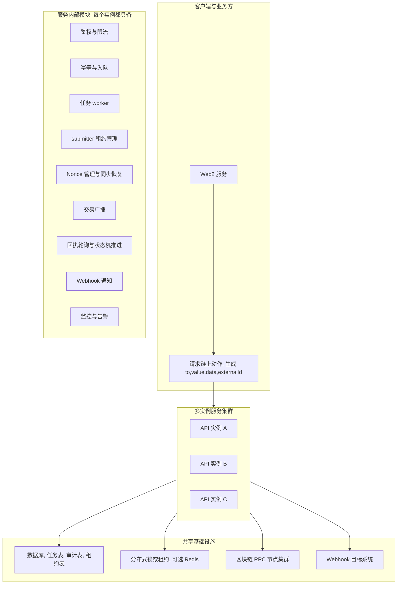
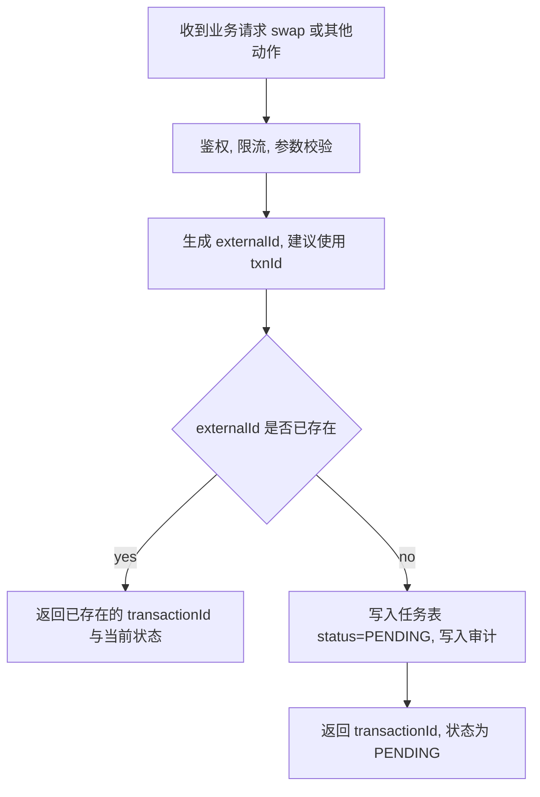
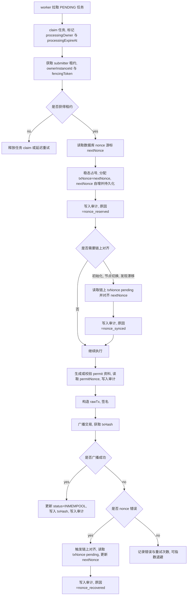
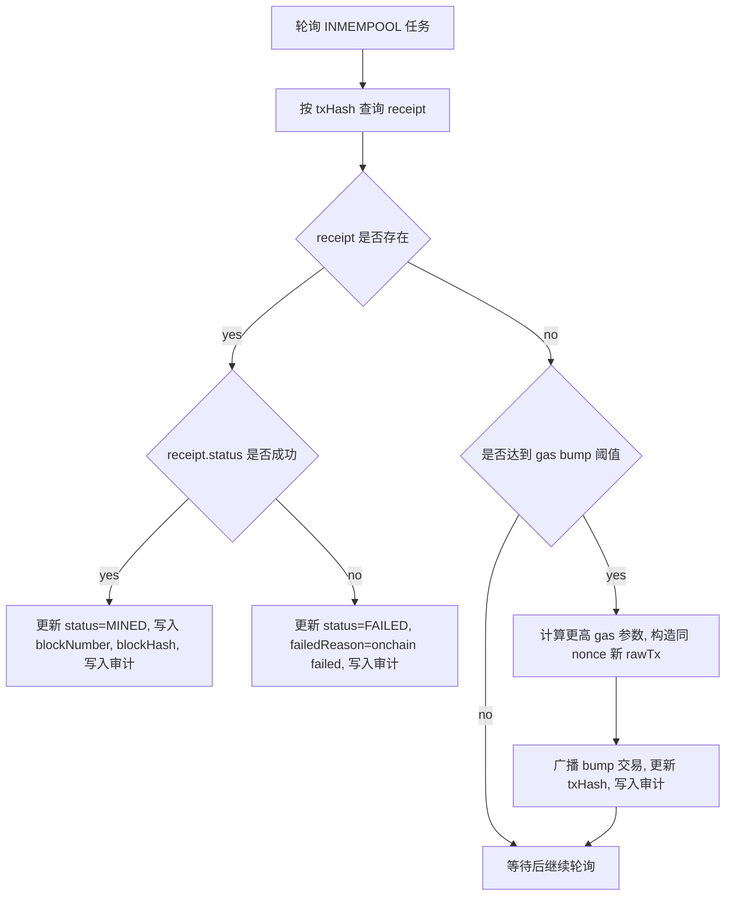
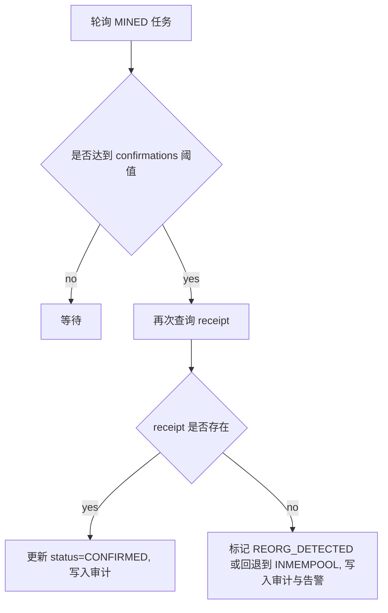
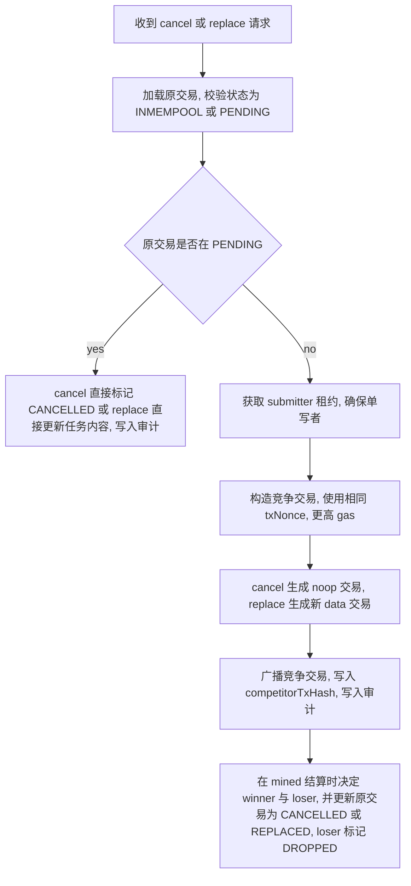
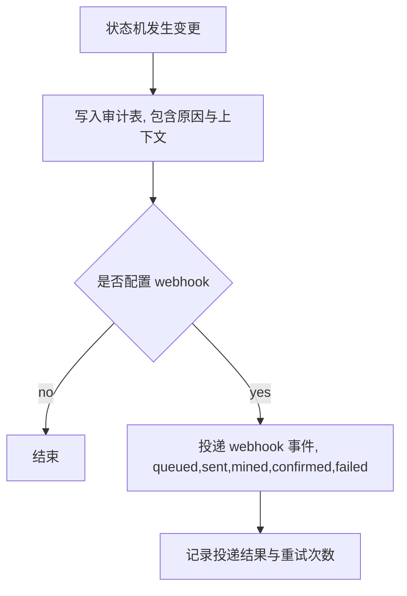
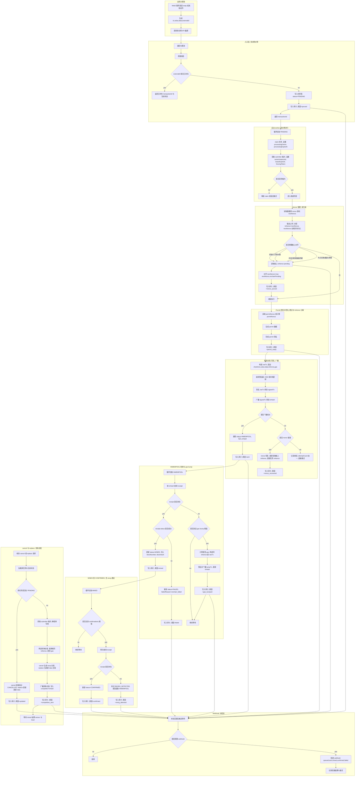

### 重构目标与背景

本次重构目标是把当前 Java 服务中同步直发链上交易的模式, 改造成类似 rrelayer 的交易队列与 nonce 管理体系, 同时满足多实例部署的高可用与水平扩展需求.

现状参考 Java 代码关键特征

- 入口方法 swap 直接获取 nonce, 组装 permit 相关参数与签名, 立即构造 RawTransaction 并 ethSendRawTransaction 广播
- 失败处理依赖同步异常, 常见分支包括 nonce error, timeout, submit failed
- 交易生命周期主要靠 insertBcTxnMgt 落库记录, 但发送与状态推进强依赖当前进程
- 多实例下若同一 submitter 被并发处理, 可能出现 nonce 冲突, 重复广播, 状态漂移

本项目 rrelayer 参考的关键思想

- 把交易抽象为通用输入, to, value, data, 可选 blobs, 并以状态机推进 PENDING, INMEMPOOL, MINED, CONFIRMED, FAILED 等
- 入口只做校验与入队落库, 实际发送由后台循环处理
- NonceManager 维护每个 relayer 的内部 nonce, 发送前与链上 nonce 做同步, 发生 nonce 错误时做恢复与回写
- 支持 gas bump, 支持 cancel 与 replace 的同 nonce 竞争, 并在 mined 时结算 winner 与 loser

### 第一部分 纯产品与架构描述, 不涉及代码

#### 核心结论

可行, 但需要把系统改造成单写者原则加分布式协调.

- 单写者原则: 对同一 submitter 地址, 任意时刻只允许一个实例分配 nonce 并广播交易
- 分布式协调: 多实例并发下用分布式锁或租约保证单写者, 并避免多个实例重复处理同一笔任务
- 生命周期持久化: 所有关键状态必须落库, 任何实例崩溃后可由其他实例恢复推进

#### 为什么必须重构成队列模式

同步直发在多实例下会把链上不确定性放大为业务不确定性

- nonce 冲突不可避免, 并发请求会拿到相同 nonce 或错序 nonce
- timeout 不等于失败, 可能广播成功但拿不到 hash, 继续重试会重复广播
- 发送与状态推进耦合在一个线程里, 进程挂掉时缺少可恢复的中间态
- 业务方无法稳定获得一致的交易状态, 只能靠日志或人工对账

队列模式把不确定性收敛到可观测的状态机

- 入口快速返回已受理, 后台负责可靠发送与重试
- 任何节点都可基于数据库恢复, 不丢任务
- 通过状态机与审计日志, 可以解释每一次重试, bump, cancel, replace 的原因与结果

#### 适配各种合约调用的统一抽象

对使用者 Web2 服务而言, 合约调用统一为以下输入

- to, 目标合约地址
- value, 随交易发送的原生币数量, 多数为 0
- data, ABI 编码后的 calldata
- blobs 可选, EIP-4844 需要时才传
- externalId, 业务幂等键, 建议直接用 txnId 或其派生值

系统不需要理解具体合约业务语义, 只要能稳定完成 nonce, gas, 签名, 广播, 回执追踪即可.

#### Permit 与交易 nonce 的边界与建议

从 Java 代码看, permitIn 与 permitOut 都使用了同一个 nonce 变量, 同时该 nonce 还作为链上交易 nonce 使用. 这在产品设计上存在高风险, 因为常见 permit 体系存在独立的 nonce 域.

建议在重构中显式区分两个概念

- txNonce, 账户交易 nonce, 来自链上 eth_getTransactionCount pending
- permitNonce, permit 体系 nonce, 来自 permit 合约 nonce 或你们的业务 nonce 体系

设计策略建议

- 如果 permitNonce 是链上合约维护, 则必须在后台任务执行时读取合约 nonce, 并确保签名与发送使用同一组 permitNonce
- 如果 permitNonce 是业务维护, 则要像 txNonce 一样做并发控制与幂等, 并把 permitNonce 的使用记录持久化

否则会出现签名可用但广播失败, 或广播成功但 permit 校验失败, 且多实例重试时会加剧问题.

#### 目标系统的模块划分

建议将现有同步直发服务拆成以下模块, 这些模块可以在同一服务进程内, 也可以拆成独立服务, 但建议先同进程落地以降低复杂度.

- API 网关层
  - 鉴权, 限流, 参数校验
  - 幂等处理, 以 externalId 或 txnId 作为幂等键
  - 入队落库, 返回 taskId 或 transactionId

- 交易编排层 Transaction Orchestrator
  - 把业务 DTO 转换为通用交易请求, to, value, data, chainId, submitter
  - 负责 permit 资料准备, 但应避免在入口阶段完成所有签名以减少重试副作用

- 队列与状态机层 Transaction Queue Engine
  - 从数据库拉取 PENDING 任务
  - 获得 submitter 租约后才允许进入发送阶段
  - 写入状态变更与审计日志

- Nonce 管理层 Nonce Service
  - 维护每个 submitter 的本地 nonce 缓存
  - 发送前与链上 nonce 同步
  - 遇到 nonce 错误时执行恢复, 更新队列与数据库

- 广播与回执层 Broadcaster And Receipt Tracker
  - 广播 raw tx
  - 轮询 receipt 推进 MINED, CONFIRMED
  - 触发 gas bump, 或进入 cancel, replace 竞争流程

- 可观测与回调层 Observability
  - webhook 回调, on_queued, on_sent, on_mined, on_confirmed, on_failed
  - 统一 metrics 与 tracing, 能解释每次重试原因

#### 多实例部署的关键设计, 分布式锁或租约

你的目标是多实例部署, 所以必须解决两个问题

- 问题 1 同一 submitter 的单写者
- 问题 2 同一任务只被一个 worker 处理

建议采用租约机制, 并允许两种实现路径

方案 A 数据库租约表, 推荐优先落地

- 建一张 submitter_lease 表, 主键为 chainId 加 submitterAddress
- 字段包含 ownerInstanceId, leaseExpireAt, fencingToken 递增版本, updatedAt
- 抢占规则
  - 只有当 leaseExpireAt 小于 now 才能抢占
  - 抢占成功后更新 ownerInstanceId 与 leaseExpireAt, 并获取新的 fencingToken
- 续租规则
  - owner 周期性续租, 延长 leaseExpireAt
  - 若续租失败则停止处理并释放本地队列
- 使用规则
  - 任何涉及 txNonce 分配与广播的步骤, 必须带上 fencingToken 做写入保护
  - 数据库更新交易状态时校验 fencingToken, 防止脑裂双写

方案 B Redis 锁加租约, 适合已有 Redis 基础设施

- 使用 setnx 加 ttl 作为 lease
- 同样建议引入 fencingToken, 可用 Redis 自增或数据库版本号实现
- 风险点是 Redis 故障与网络分区, 必须配合 fencingToken 才能防止双写

任务级别的去重与 claim

- 建议把交易任务表按 status 分区处理
- worker 拉取任务时使用 claim 机制确保同一条记录只被一个 worker 获取
- 数据库实现可用 for update skip locked
- claim 后写入 processingOwner 与 processingExpireAt, 避免 worker 崩溃导致长时间卡死

#### 交易生命周期状态机设计

建议定义与 rrelayer 类似的状态, 并补齐你们已有的 SUBMITTED, NONCE_ERROR 等语义.

- PENDING, 已入队待发送
- INMEMPOOL, 已广播等待上链
- MINED, 已上链等待确认
- CONFIRMED, 已确认完成
- FAILED, 终态失败, 包括永久性错误与多次重试后失败
- NONCE_SYNC, 中间态, 表示检测到 nonce 不一致并已执行恢复
- REPLACED, CANCELLED, DROPPED, 竞争相关终态或中间态

每次状态变更都必须写入审计日志表, 包含原因, 错误信息, 实例 id, fencingToken, 时间戳, 以及关键链上字段 txHash, blockNumber, blockHash.

#### 高并发能力的来源

该体系的高并发能力不是来自同一 submitter 的并行写, 而来自分片与并行度控制

- 多 submitter 并行, 每个 submitter 单写者
- 多 chain 并行, 每条 chain 独立队列与参数
- 入口层可水平扩展, 只做校验与入队
- worker 层按 submitter 分布, 多实例共同分摊不同 submitter 的负载

#### 单点故障与恢复策略

多实例下单点故障不应导致任务丢失

- 入口实例故障, 任务已落库, 可由其他实例继续处理
- worker 实例故障, 租约到期后其他实例接管 submitter
- 广播后拿不到 hash 的场景
  - 必须把 rawTx 或其 hashable 表示持久化, 并在恢复时通过链上查询或重广播确认
  - 或在业务层采用 externalId 幂等, 避免重复创建任务

#### 回滚与分叉的产品层处理

建议在产品层把 confirmed 作为最终成功, mined 仅作为中间态.

- confirmed 基于 confirmations 阈值, 并在确认前再次校验 receipt
- 若 mined 后 receipt 消失, 视为潜在 reorg, 状态回退为 INMEMPOOL 或进入 REORG_DETECTED 并触发重新查询与重试
- 该逻辑应纳入审计与告警, 便于定位链异常

### 第二部分 整体项目设计与 Mermaid

#### 整体框架图

#### 入口入队与幂等流程

#### worker 处理 PENDING 与发送流程, 含租约

#### INMEMPOOL 轮询与 gas bump 流程

#### MINED 到 CONFIRMED 流程, 含 reorg 检测建议

#### cancel 与 replace 的竞争流程, 产品语义

#### Webhook 与可观测流程

#### 全景流程图, 多实例, 租约, 状态机, nonce, permit, 广播, 回执, 竞争

### 关键落地建议与实施顺序

建议按可控增量推进, 避免一次性替换带来不可控风险.

阶段 1 入口幂等与任务落库

- 入口不再直接发送交易, 只写任务表并返回 transactionId
- 保留旧链路作为对照, 通过灰度开关切流

阶段 2 单实例 worker, 引入状态机推进

- 先在单实例上实现 PENDING 到 INMEMPOOL 到 MINED 到 CONFIRMED 的完整推进
- 打通审计与 webhook

阶段 3 多实例, 引入租约与 claim

- 引入 submitter 租约与 fencingToken
- 引入任务 claim 与 processingExpireAt
- 验证故障切换与脑裂防护

阶段 4 竞争交易与高级策略

- 引入 gas bump
- 引入 cancel 与 replace
- 引入 reorg 检测与回退策略

验收标准建议

- 幂等, 相同 externalId 不会产生多条任务
- 多实例并发下, 同一 submitter 不发生 nonce 冲突或冲突可自愈且不丢单
- timeout 场景下不重复扣款或重复执行, 状态可追踪
- 任意实例崩溃后, 任务可在租约到期后被其他实例接管并继续推进